# DSO202 Assignment 1: Three-Tier Application Deployment on Kubernetes Cluster
**Environment:** Windows/WSL (linux/amd64) on Kind Cluster

---

## Overview

This report documents the deployment of a three-tier Task Tracker application (frontend, backend, database) onto a local kind Kubernetes cluster, along with the architectural reasoning, configuration decisions, and verification evidence.

The application follows a standard three-tier pattern:

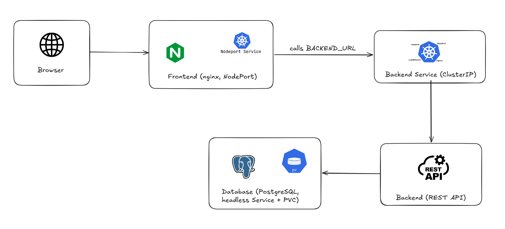

Container images used:

| Tier | Image | Internal Port |
|---|---|---|
| Frontend | `rynorbu11/dso202-frontend:1.0` | 8080 |
| Backend | `rynorbu11/dso202-backend:1.0` | 8080 |
| Database | `rynorbu11/dso202-db:1.0` | 5432 |

## Task 1: Namespace and Architecture Note

**Namespace:** `dso202-assignment-01`

Before creating the Kubernetes manifests, I identified the main Kubernetes components and objects required to deploy and manage the three-tier Task Tracker application.

### Kubernetes Architecture

**Control-Plane Components**

- **kube-apiserver:** Acts as the main entry point for Kubernetes commands such as kubectl apply and kubectl create. It receives and validates the configuration files and passes the requested changes to the cluster.
- **etcd:** Stores the cluster's configuration and current state. It keeps information about the `Namespace, ConfigMap, Secret, Deployments, Services, PVC, ResourceQuota, and LimitRange` used in this assignment.
- **kube-scheduler:** Decides which worker node should run each Pod. It considers factors such as available resources and the CPU and memory requests and limits defined for the Pods.
- **kube-controller-manager:** Continuously checks whether the actual state of the cluster matches the desired state. The Deployment and ReplicaSet controllers ensure that the required number of Pods are running. This is why the backend Pod was automatically recreated after it was manually deleted during the self-healing test.


**Node Components**

- **kubelet:** Runs on each worker node and manages the Pods assigned to that node. It starts, monitors, and maintains the containers running inside the Pods.
- **kube-proxy:** Maintains the networking rules required for Kubernetes Services to route traffic to the correct Pods. It supports the ClusterIP, Headless, and NodePort Services used in this assignment. This allows Service communication to continue even when Pods are recreated and receive new IP addresses.
- **Container Runtime (containerd):** Pulls the required container images and starts the containers inside the Pods. In this deployment, the images are stored in my Docker Hub repository and are loaded into the kind cluster for use by the worker nodes.

### Architecture Description

The three-tier Task Tracker application uses different Kubernetes objects based on the requirements of each tier.

- **Deployments:** Deployments are used for the frontend, backend, and database tiers. They maintain the required number of Pods and provide self-healing and rolling update capabilities.
- **PersistentVolumeClaim (PVC):** A PVC is used for the database tier to provide persistent storage. This ensures that the PostgreSQL data remains available even if the database Pod is deleted and recreated.
- **Services:** Different Service types are used according to the access requirements of each tier:
  - **Headless Service (db-svc):** The database uses a Headless Service with clusterIP: None. This provides stable internal DNS-based access to the database within the Kubernetes cluster.
  - **ClusterIP Service (backend-svc):** The backend uses a ClusterIP Service so that the API remains accessible only inside the Kubernetes cluster and is not directly exposed to external users.
  - **NodePort Service (frontend-svc):** The frontend uses a NodePort Service to allow users to access the application through a web browser from outside the cluster.


Objects chosen per tier, and why


| Tier | Objects used | Reasoning |
|---|---|---|
| Frontend | Deployment + NodePort Service | Needs to be reachable from outside the cluster (a browser on the host machine), so NodePort exposes it on a fixed port across every node. |
| Backend | Deployment + ClusterIP Service | Should only be reachable from other Pods inside the cluster (the frontend), never directly from outside ClusterIP provides internal-only, load-balanced access. |
| Database | Deployment (single replica) + PersistentVolumeClaim + headless Service | A single stateful instance doesn't need load-balancing across replicas; a headless Service (`clusterIP: None`) gives direct Pod DNS resolution instead, which is the idiomatic pattern for stateful workloads. The PVC ensures data outlives any single Pod's lifecycle. |

---

## Task 2: Configuration and Secrets
### Secret Handling and Security Note

The `app-secret` manifest contains the application's credential values in Base64-encoded form. Kubernetes Secrets use Base64 encoding by default, which is **not the same as encryption**. Base64 values can be easily decoded by anyone who has permission to view the Secret or access the underlying etcd data.

For this assignment, this approach is acceptable because it demonstrates the use of Kubernetes Secrets for managing sensitive configuration values. However, in a production environment, I would use **encryption at rest** through Kubernetes `EncryptionConfiguration` or an external **Key Management Service (KMS)** to provide stronger protection for secret data.

### ConfigMap and Secret Configuration

The `app-config` ConfigMap stores all non-sensitive configuration values required by the application. These include:

* `DB_HOST`
* `DB_PORT`
* `DB_NAME`
* `APP_PORT`
* `CORS_ORIGIN`
* `POSTGRES_DB`
* `BACKEND_URL`

The `app-secret` Secret stores the sensitive credential values:

* `DB_USER`
* `DB_PASSWORD`
* `POSTGRES_USER`
* `POSTGRES_PASSWORD`

The database and backend use different variable names for their configuration. The backend application expects `DB_NAME`, `DB_USER`, and `DB_PASSWORD`, while the official PostgreSQL image expects `POSTGRES_DB`, `POSTGRES_USER`, and `POSTGRES_PASSWORD`.

To ensure that the backend can successfully authenticate with the PostgreSQL database, both sets of variables are configured with matching values. The backend Deployment uses the `DB_*` variables, while the PostgreSQL Deployment uses the `POSTGRES_*` variables.

This separation keeps non-sensitive configuration in the ConfigMap and sensitive credentials in the Secret, following the recommended Kubernetes approach for managing application configuration.

### Security Consideration

It is important to understand that Kubernetes Secrets are **Base64-encoded rather than encrypted at rest by default**. Therefore, anyone with sufficient Kubernetes permissions, such as permission to run `kubectl get secret -o yaml`, may be able to decode the stored credentials. Access to the underlying etcd data could also expose the values.

For this Unit I assignment, encryption at rest is outside the required scope. In a real production environment, I would implement encryption at rest using a KMS provider or Kubernetes `EncryptionConfiguration` as part of production security hardening.

**Evidence**

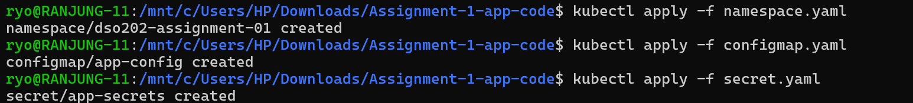
> applied the manifest file that I have created for the secret and configmap.

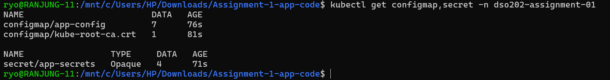
> verified that the secret and configmap were created successfully in the `dso202-assignment-01` namespace.

This is the detials of the secret that I have created. It is base64 encoded and contains sensitive credential values required by the application.


This is the detials of the configmap that I have created. It contains all non-sensitive configuration values required by the application.


---

## Task 3: Database Tier

The database tier uses a *PersistentVolumeClaim (PVC)* named `db-pvc` to provide 1Gi of persistent storage. The PVC uses the **ReadWriteOnce** access mode and the default standard StorageClass provided by the kind Kubernetes cluster. No custom StorageClass was created for this deployment.

The `db-deployment` runs a single PostgreSQL replica and mounts the PVC at `/var/lib/postgresql/data`, ensuring that the database data is stored on persistent storage. The PostgreSQL configuration values, including *POSTGRES_DB*, *POSTGRES_USER*, and *POSTGRES_PASSWORD*, are obtained from the ConfigMap and Secret.

A headless Service named `db-svc` is used to provide network access to the PostgreSQL database. It uses `clusterIP: None` and exposes port `5432`, allowing other applications within the Kubernetes namespace to communicate with the database using its service name.

**Evidence**

Applied the database manifest and verified that the PostgreSQL pod is running and the PVC is bound to a PersistentVolume.


> This is the event logs for the database pod, showing that it has started successfully and is ready to accept connections.


Verified that the database pod is running and the PVC is bound to a PersistentVolume.


> This shows the database pod is running and the PVC is bound to a PersistentVolume.

This is the details of the PVC that I have created for the database pod. It shows that the PVC is bound to a PersistentVolume and has a capacity of 1Gi.

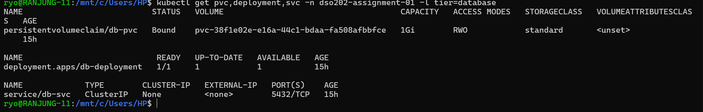

## Task 4: Backend Tier

The backend tier is deployed using a Deployment named `backend-deployment`. It receives the required non-sensitive configuration values, including `DB_HOST`, `DB_PORT`, `DB_NAME`, `APP_PORT`, and `CORS_ORIGIN`, from the ConfigMap. The sensitive values, `DB_USER` and `DB_PASSWORD`, are obtained from the Secret. The `DB_HOST` is set to `db-svc`, which matches the name of the database Service, allowing the backend to connect to the PostgreSQL database within the Kubernetes cluster.

A ClusterIP Service named `backend-svc` is used to provide access to the backend within the Kubernetes namespace. It exposes port 8080 internally and is not exposed through a NodePort or LoadBalancer. This keeps the backend service accessible only inside the cluster and satisfies the assignment's requirement that the backend must not be externally exposed.

**Evidence**

Applied the backend manifest and verified that the backend pod is running and the ClusterIP service is created.

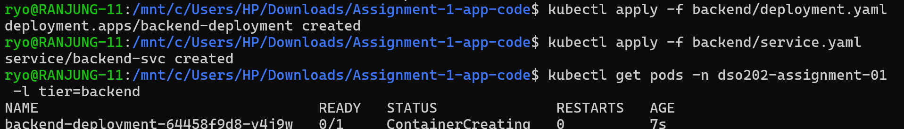

Successfully pulled the backend image from Docker Hub and verified that the backend pod is running.


> It took about 3 minutes 30 seconds to get the pod in running state.

## Task 5: Frontend Tier

The frontend tier is deployed using a Deployment named `frontend-deployment`. It obtains the `BACKEND_URL` value from the ConfigMap, which is set to `http://backend-svc:8080`. This allows the frontend to communicate with the backend service using its Kubernetes Service name.

A NodePort Service named `frontend-svc` is used to make the frontend accessible from outside the Kubernetes cluster. It exposes the application on port `8080` through nodePort `30080`. This matches the extraPortMappings configuration in the kind-cluster.yaml file from Practical 1, where host port 30080 is mapped to container port 30080.

**Implementation and Evidence**

Applied the frontend manifest and verified that the frontend pod is running and the NodePort service is created.

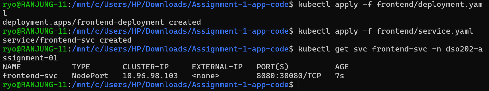

> Successfully created the frontend deployment and service. The type of the service is NodePort, which allows external access to the frontend application.

**Implementation Note:** The frontend is a lightweight Node.js/Nginx container, so it does not require high resource limits. The backend and database tiers are more resource-intensive, so they have higher resource requests and limits.

## Task 6: Namespace Resource Governance

I applied a ResourceQuota and LimitRange to the `dso202-assignment-01` namespace to control resource usage across the frontend, backend, and database Deployments.

- **ResourceQuota:** The namespace has a maximum of `1 CPU` and `1Gi` of memory for resource requests. The three application tiers are lightweight, consisting of a static `Nginx` frontend, a small `Node.js` REST API, and a single `PostgreSQL` instance containing a small amount of demonstration data. The combined default requests are approximately `250m CPU` and `320Mi memory`, so the quota provides enough headroom for normal operation and rolling updates while preventing excessive resource consumption on the resource-constrained kind cluster.

- **LimitRange:** The LimitRange provides default CPU and memory requests and limits for containers that do not specify their own values. This ensures that containers are not allowed to run without resource boundaries and helps maintain predictable resource usage within the namespace.

> **Justification:** These resource limits are suitable for the lightweight three-tier application and the available resources of the kind cluster. The ResourceQuota prevents the namespace from consuming excessive resources, while the LimitRange ensures that individual containers have reasonable resource boundaries. Together, they reduce the risk of one container consuming too many resources and affecting the other application tiers.

**Implementation Evidence:**

Applied the manifest file for quota.

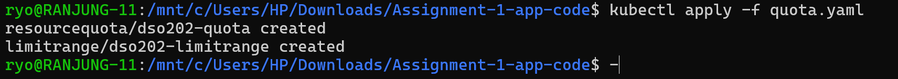

This is the details of the ResourceQuota that I have created for the namespace.

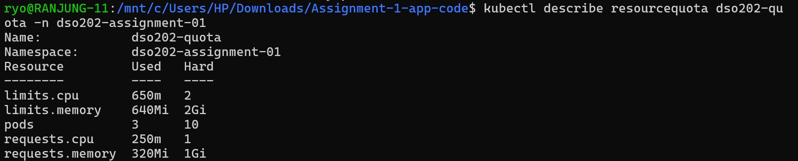

> It shows that the maximum CPU and memory requests are set to 1 CPU and 1Gi respectively.

This is the details of the LimitRange that I have created for the namespace.

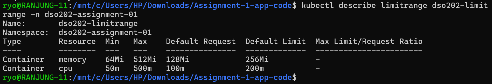

> It shows that the default CPU and memory requests and limits are set for containers in the namespace. The maximum CPU and memory limits are set to 500m and 512Mi respectively and minimum CPU and memory limits are set to 50m and 64Mi respectively.

---

## Task 7: Verification and Interactivity

I performed several tests to verify that the three-tier application was working correctly and that the Kubernetes resources behaved as expected.

### a. Full CRUD Cycle

> I tested the complete CRUD (Create, Read, Update, Delete) cycle using curl through the backend Service. Since the backend Service is only accessible inside the cluster, I used port forwarding with the following command:

`kubectl port-forward -n dso202-assignment-01 svc/backend-svc 8080:8080`


The CRUD test successfully demonstrated that a task could be created, retrieved, updated, and deleted through the backend API.

**Implementation Evidence:**

1. **Method: GET**

I have successfully retrieved the list of tasks from the backend API using the GET method.

> There are 3 tasks in the database, which are displayed in the response.

Using `curl`, I sent a GET request to the backend API to retrieve the list of tasks.


Using `Postman`, I sent a GET request to the backend API to retrieve the list of tasks.


Checked the status of the backend pod to ensure it was running and ready to accept requests.

**Using Postman.**


2. **Method: CREATE (POST):**

Using the POST method, I successfully created a new task with the title "test task" in the backend database.

> First I have used the curl command to create a new task with the title `"ranjung demo task"` in the backend database.


Successfully created a new task with the title "ranjung demo task" in the backend database.

**Verify in Frontend UI:**
Frontend application is able to display the newly created task in the task list.


> The id is 8

Then from the `Postman` I have created a new task with the title `"Assignment 1 Task"` in the backend database.


Created a new task with the title "Assignment 1 Task" in the backend database.

**Verify in Frontend UI:**
Frontend application is able to display the newly created task in the task list.


3. **Method: UPDATE (PUT):**

I have successfully updated an existing task using the PUT method.

> I have used the curl command to update the task with ID 8 to update the status to `done` in the backend database.


**Verify in Frontend UI:**

The frontend application is able to display the updated task with the new status `done`.


I have also update the task with ID 9 to update the description to `Assignment 1 Task Updated` and staus to `done` in the backend database.


**Verify in Frontend UI:**

The frontend application is able to display the updated task with the new description and status.


4. **Method: DELETE (DELETE):**

I have successfully deleted an existing task `Ranjung Task` and `Assignment 1 Task` using the DELETE method.


Successfully deleted the tasks with ID 8 and 9 from the backend database.

**Verify using GET method**

I have used the GET method to verify that the tasks with ID 8 and 9 have been deleted from the backend database.


### b. Service DNS Resolution
I verified that Kubernetes Service DNS resolution was working correctly by accessing the backend Service from inside the frontend Pod.

The backend Service was successfully resolved using its Kubernetes Service name, backend-svc, demonstrating that the frontend can communicate with the backend through Kubernetes' internal DNS system without using an external IP address.

**Implementation Evidence:**


### c. Self-healing and Data Persistence

I tested Kubernetes' self-healing capability by first creating a task and then manually deleting the backend Pod. Kubernetes automatically detected that the required Pod was no longer running and created a replacement Pod.

After the new backend Pod reached the Running state, I retrieved the previously created task and confirmed that the data was still available. This demonstrates that the Pod lifecycle is independent of the PersistentVolume lifecycle. The backend Pod can be replaced without losing data stored in the persistent database volume.

**Implementation Evidence:**

First, I created a new task with the title `"persistence check"` in the backend database.


**UI Verification:**


From one terminal, I watched the backend Pod events to monitor its status.

`kubectl get pods -n dso202-assignment-01 --watch`

Then I deleted the backend Pod to simulate a failure and trigger Kubernetes' self-healing mechanism.


The backend Pod was automatically recreated by Kubernetes, and the new Pod reached the Running state.

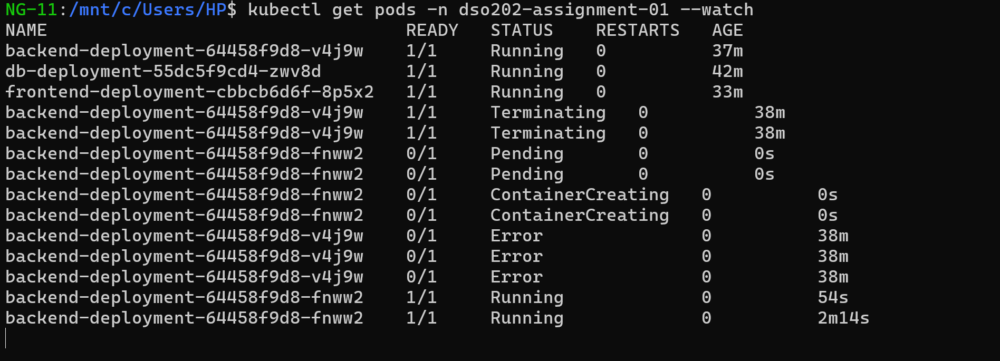

> See the backend pod initial status is running then it was terminating and then it was starting again. It took around 2 minutes to get the pod in running state.

After this I have rechecked the task list using the GET method to verify that the previously created task was still present in the backend database.


**Using curl command:**


> The task with the title `"persistence check"` is still present in the backend database, confirming that the data persisted across Pod restarts.

**Verify in the frontend UI:**


This proves that the backend Pod can be replaced without losing data stored in the persistent database volume, demonstrating Kubernetes' self-healing and data persistence capabilities.

### d. Declarative vs. Imperative Comparison

I created the `backend-svc` Service using both declarative and imperative approaches to compare the two methods.

The declarative approach uses a YAML manifest to define the desired state of the Service. This approach is more suitable for the assignment because the configuration can be stored in version control, reviewed, reused, and applied consistently. Anyone reviewing the YAML file can clearly see the exact configuration of the Service.

**Imperative Approach:**

*Declarative Deployment*

First, I have used the declarative approach to create the `backend-svc` Service. I have saved the configuration in a YAML file named `backend/declartive-backend-svc.yaml`.

> After that I have applied the manifest file.

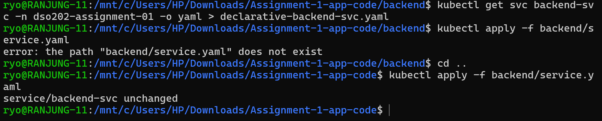

*Imperative Deployment*

After deleting the declarative service, I recreated it using a single kubectl command. I have used `kubectl expose` command to create the `backend-svc` Service imperatively.

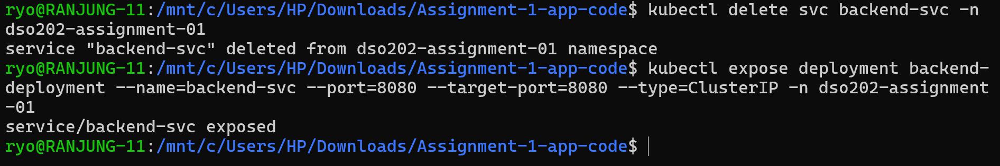

Then I have saved the configuration of the imperatively created Service to a YAML file named `backend/imperative-backend-svc.yaml`.


> Imperative Deployment: The imperative approach creates the resource directly using a kubectl command. It is quicker and convenient for testing or one-time tasks, but the configuration is not automatically stored as a reusable file. This makes it easier to forget settings or create differences when recreating the resource later.

**Technical Analysis of the diff**

I have used the diff command to compare the declarative and imperative YAML files.

The diff command revealed several critical differences between the two resources:


**A. kubectl.kubernetes.io/last-applied-configuration Annotation**

- **Observation:** This annotation was present in the declarative version but not in the imperative version.

- **Significance:** When kubectl apply is used, Kubernetes stores the last applied configuration in this annotation. This helps Kubernetes compare the previous configuration with a new configuration when changes are made. The imperative approach does not normally store this information, making configuration management less convenient.

**B. ClusterIP Address**

- **Observation:** The declarative Service had the ClusterIP 10.96.251.105, while the imperative Service had 10.96.60.124.

- **Significance:** The two Services were given different IP addresses even though they used the same Service name, backend-svc. This shows that ClusterIP addresses are assigned by Kubernetes and should not be hardcoded in the application. Using the Service name and DNS is more reliable because Kubernetes can resolve the name to the correct IP address.

**C. Metadata Fields**

- **Observation:** The uid, resourceVersion, and creationTimestamp values were different in the two YAML files.

- **Significance:** These values are automatically generated by Kubernetes to identify and track resources. The differences show that the two Services were separate Kubernetes objects created at different times. They are not configuration settings that should normally be manually edited or included in the deployment YAML.

**Comparison Summary**

| Feature | Declarative Approach (`apply`) | Imperative Approach (`expose`) |
| :--- | :--- | :--- |
| **Tracking** | Stores state in metadata annotations. | No state tracking provided. |
| **Connectivity** | Stable as long as the resource is updated. | Risk of IP change if deleted/recreated. |
| **Teamwork** | Excellent; YAMLs can be reviewed in Git. | Poor; commands are lost in terminal history. |
| **Use Case** | Production, CI/CD, and Lab assignments. | Troubleshooting and quick prototyping. |

## Challenges Faced and How They Were Resolved

I have faced many challenges during the deployment of the three-tier application on the kind Kubernetes cluster. Some of the challenges and their resolutions are as follows:

**1. Architecture Mismatch (ARM64 vs AMD64)**

**Problem:** The application images could not be pulled or scheduled in the Kubernetes cluster, and the following error was displayed:


As soon as I got this error message, I checked the logs of the pod to see if there were any additional error messages.


> In the logs, I have found that the image is failing to pull and got the `ImagePullBackOff` error.

**Cause:** The provided Docker images were built only for Linux ARM64, while my Windows/WSL2 environment uses an AMD64 architecture. Checking the image manifests confirmed that the images only supported ARM64.

**Resolution:** 

I have built the frontend, backend, and database images using the provided Dockerfiles and pushed them to my Docker Hub account (rynorbu11/dso202-...).

When building the images, I specified --platform linux/amd64 to make sure that Docker built the images for the AMD64 architecture, which matches my Windows/WSL2 environment. This is important because the original images were built for ARM64 and could not run correctly on my AMD64 system.

The `--platform linux/amd64` option tells Docker: "Build this image for a Linux system using the AMD64 CPU architecture." This ensures that the resulting image is compatible with the architecture used by my Kubernetes cluster.

The command I used to push to my Docker Hub account is as follows:

```bash
docker build -t --platform linux/amd64 rynorbu11/dso202-frontend:1.0 frontend/
```

By specifying linux/amd64, I ensured that the image could run on my AMD64-based environment and avoided the architecture mismatch problem.

So after building the images, I have pushed them to my docker hub accoount and used that images in the Kubernetes manifests to deploy the application successfully.


**The images link are:**
- Frontend: [rynorbu11/dso202-frontend:1.0](https://hub.docker.com/r/rynorbu11/dso202-frontend)
- Backend: [rynorbu11/dso202-backend:1.0](https://hub.docker.com/r/rynorbu11/dso202-backend)
- Database: [rynorbu11/dso202-db:1.0](https://hub.docker.com/r/rynorbu11/dso202-db)

**2. Browser Could Not Reach the Backend Directly**

**Problem:** The frontend displayed "BACKEND UNREACHABLE", and the browser console showed CORS and NS_ERROR_DOM_BAD_URI errors when trying to access http://backend-svc:8080.

**Cause:** The backend-svc Service uses a ClusterIP and its DNS name is only available inside the Kubernetes cluster. CoreDNS allows Pods within the cluster to resolve backend-svc, but a browser running on the host machine cannot resolve this internal Kubernetes DNS name.

This behavior was expected because the assignment requires the backend to remain internally accessible and not be exposed through a NodePort or LoadBalancer.


**Solution:** For CRUD testing, I used curl through a port-forwarded backend Service. This allowed me to access the backend from the host while keeping the actual Kubernetes Service internal to the cluster.

I also tested an optional browser-based solution by mapping backend-svc to `127.0.0.1` in the Windows hosts file and using a matching port-forward. However, the port-forwarded curl method was sufficient for the required CRUD verification.