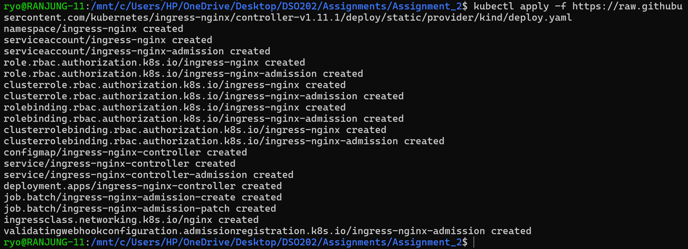

# DSO202 Assignment 2

### Step 3 — Install the nginx Ingress Controller

That error means the Ingress Controller pod needs to run on a node with a specific label, but your node doesn't have it. This is the classic kind + Ingress nginx issue.

## Most common cause — kind needs extra port mapping

The nginx Ingress Controller on kind needs the cluster to have ports 80 and 443 mapped. A plain kind create cluster does not do this by default.

