# DSO202 Assignment 2: StatefulSets and Ingress (Traefik) for the Three-Tier Task Tracker

## Overview

In Assignment 1, I deployed the three-tier Task Tracker (frontend, backend, PostgreSQL) using only Deployments, a standalone PVC and a NodePort Service. In this assignment, I re-implemented the same application using the concepts from Unit 2:

- **StatefulSets** for the database tier, with a **headless Service** and **volume claim templates**, which give it a stable network identity, stable storage and ordered deployment and scaling.
- An **Ingress** with the **Traefik Ingress Controller** as the single entry point to the application. It uses routing rules, TLS termination, name-based virtual hosting and Traefik-specific annotations.

The same container images from Assignment 1 are reused without any change:

| Tier | Image | Port | Kubernetes object (A1) | Kubernetes object (A2) |
|---|---|---|---|---|
| Frontend | `rynorbu11/dso202-frontend:1.0` | 8080 | Deployment + **NodePort** Service | Deployment + **ClusterIP** Service, exposed through **Ingress** |
| Backend | `rynorbu11/dso202-backend:1.0` | 8080 | Deployment + ClusterIP Service | Deployment + ClusterIP Service, exposed through **Ingress** |
| Database | `rynorbu11/dso202-db:1.0` | 5432 | Deployment + standalone PVC + headless Service | **StatefulSet** + **volumeClaimTemplates** + **headless Service** |

### Implementation notes

## Task 1: Cluster Setup

The Ingress Controller must be reachable from my Windows browser. A plain `kind create cluster` does not publish any ports, so I created the cluster from `kind-cluster.yaml`. Its `extraPortMappings` publish ports **80** and **443** of the control-plane node container on `127.0.0.1`:

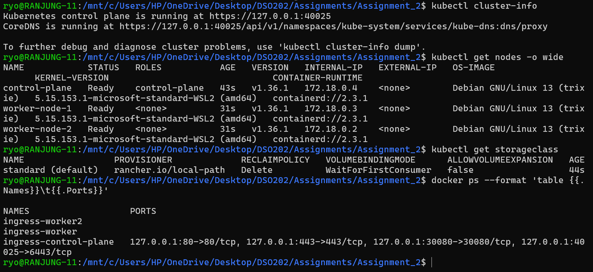

> The cluster has three Ready nodes (`control-plane`, `worker-node-1`, `worker-node-2`) running Kubernetes v1.36.1. The `standard (default)` StorageClass (`rancher.io/local-path`, `WaitForFirstConsumer`) will dynamically provision the StatefulSet volumes. `docker ps` confirms that `ingress-control-plane` publishes `127.0.0.1:80->80/tcp` and `127.0.0.1:443->443/tcp`, which are the ports Traefik uses.

---

## Task 2: Namespace, Quota, Secret and ConfigMap

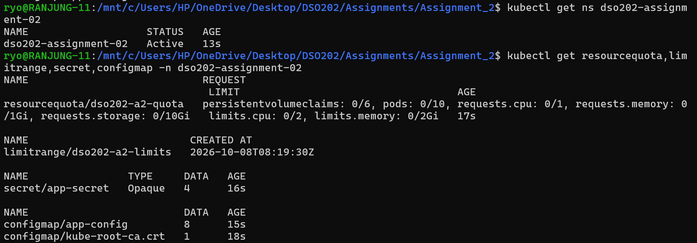

> The namespace `dso202-assignment-02` is Active. The ResourceQuota `dso202-a2-quota` limits the namespace to 10 pods, 1 CPU / 1Gi memory in requests, 2 CPU / 2Gi memory in limits, 6 PVCs and 10Gi of storage. The LimitRange gives default requests and limits to any container that does not set its own. The Secret `app-secret` holds 4 credential keys and the ConfigMap `app-config` holds 8 configuration keys.

Two ConfigMap values changed from Assignment 1 because of the Unit 2 concepts:

- **`DB_HOST`** now points to the **stable network identity** of the StatefulSet pod (`<pod>.<headless-service>`) instead of a plain Service name.
- **`BACKEND_URL: "."`** makes the frontend call the relative URL `./api/tasks`. The Ingress routes `/api` on the same hostname to the backend, so the frontend and the API share one origin (no CORS, one certificate). It also keeps working when the app is reached through `kubectl port-forward` on a different port.

---

## Task 3: Database Tier as a StatefulSet

### 3.1 Why a StatefulSet?

In Assignment 1 the database ran as a Deployment. That worked for one replica, but a Deployment treats all pods as interchangeable:

| | Deployment (A1) | StatefulSet (A2) |
|---|---|---|
| Pod name | random, e.g. `db-deployment-7d9f8-xk2p` | fixed ordinal, `db-0`, `db-1`, … |
| DNS | only the Service name | a DNS record for every pod: `db-0.db-headless` |
| Storage | one PVC shared by all replicas (created separately) | one PVC **per pod**, created from `volumeClaimTemplates` |
| Start / stop order | all at once, any order | ordered: `db-0` → `db-1` → `db-2`, reverse on scale-down |
| After a restart | new name, may attach to any PVC | **same name, same PVC** |

A database is the typical use case for a StatefulSet. Each instance owns its data, other components must find a specific instance by a predictable name, and instances should start and stop in a controlled order. The frontend and backend stay as Deployments because they are **stateless**: any replica can serve any request.

### 3.2 Headless Service

The headless Service is applied **before** the StatefulSet, because the StatefulSet's `serviceName: db-headless` is what creates the per-pod DNS records.

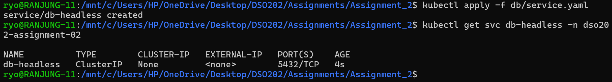

> `CLUSTER-IP` is **None**, so Kubernetes does not allocate a virtual IP or load-balance. A DNS query returns the IPs of the pods directly.

### 3.3 StatefulSet with volume claim templates

Key parts of `db/statefulset.yaml`:

The readiness probe is important for ordered deployment. With `OrderedReady`, the controller waits until a pod is **Ready**, not just Running, before creating the next one. Without the probe, "Running" would count as "Ready" even while Postgres is still initialising.

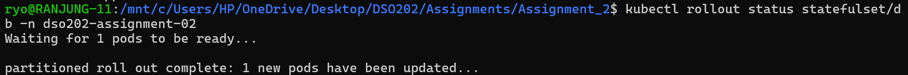

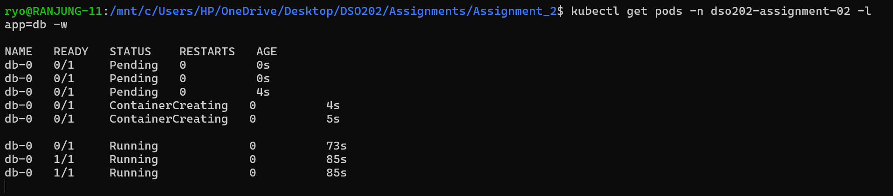

> The pod `db-0` goes from `Pending` (waiting for its PVC to be provisioned) to `ContainerCreating` to `Running 0/1`, and becomes `1/1` only after the readiness probe (`pg_isready`) succeeds.

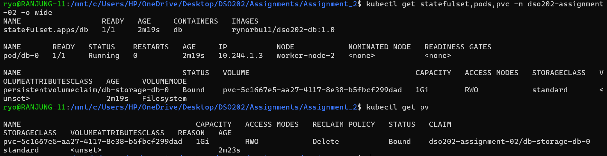

> The pod is named **`db-0`**, not a random hash. The PVC **`db-storage-db-0`** (`<template-name>-<pod-name>`) was created automatically from the volume claim template. I did not write a separate PVC manifest as in Assignment 1. The local-path provisioner dynamically created a 1Gi PersistentVolume and bound it to the claim.

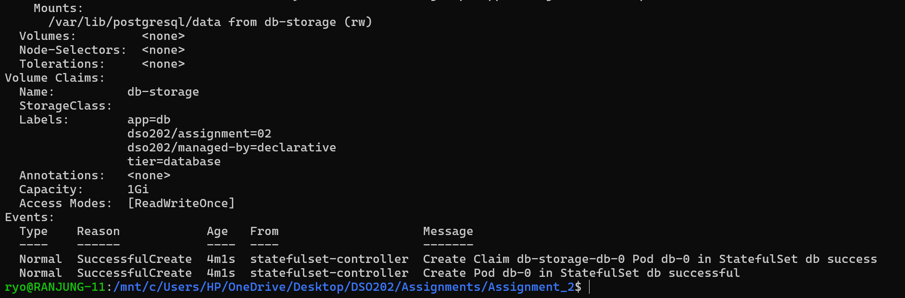

> The `Volume Claims` section shows the template (`db-storage`, 1Gi, ReadWriteOnce). The events show the order in which the StatefulSet controller works: first **`Create Claim db-storage-db-0`**, then **`Create Pod db-0`**. The storage exists before the pod starts.

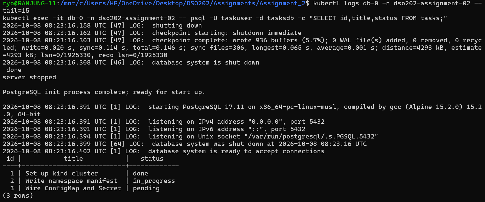

> PostgreSQL 17.11 initialised the empty volume, ran `01-init.sql` and is ready to accept connections. The `tasks` table contains the 3 seed rows.

### 3.4 Stable network identity 

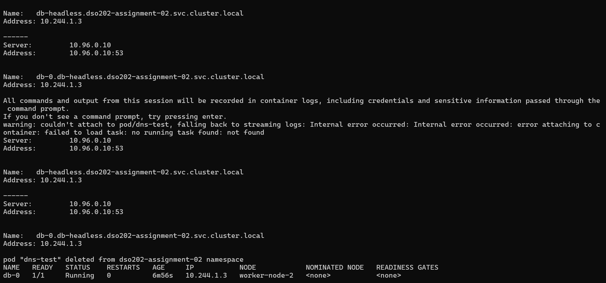

> Both `db-headless.dso202-assignment-02.svc.cluster.local` and `db-0.db-headless.dso202-assignment-02.svc.cluster.local` resolve **directly to the pod IP `10.244.1.3`**, which matches the IP of `db-0` in `kubectl get pod -o wide`. CoreDNS (`10.96.0.10`) answers with the pod IP instead of a virtual ClusterIP because the Service is headless. The name `db-0.db-headless` belongs to this one pod for its whole life, which is why the backend can use it as `DB_HOST`.

---

## Task 4: Backend and Frontend Tiers

Both tiers are stateless and remain **Deployments**. Unlike Assignment 1, **both Services are now `ClusterIP`**. The frontend no longer needs a NodePort, because the Ingress is now the single entry point into the cluster.

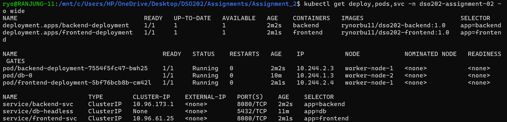

> All three tiers are running and spread across the worker nodes. `backend-svc` and `frontend-svc` are `ClusterIP`, so neither is reachable from outside the cluster without the Ingress. `db-headless` has `CLUSTER-IP None`.


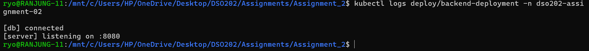

> The backend log shows `[db] connected` and `[server] listening on :8080`. This proves the backend reached PostgreSQL through the stable DNS name `db-0.db-headless` from the ConfigMap.

---

## Task 5: Ingress Controller Setup

### 5.1 First attempt: NGINX Ingress Controller

I first tried to install the NGINX Ingress Controller with its kind manifest, but the controller pod never started:

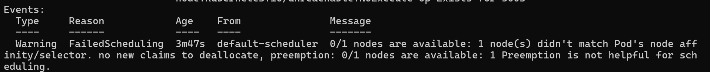

> **FailedScheduling: didn't match Pod's node affinity/selector.** The kind version of the NGINX manifest only schedules the controller on a node labelled `ingress-ready=true`, and my cluster's nodes did not have that label.

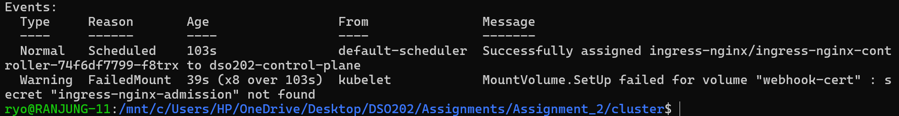

> After the pod was scheduled, it failed with **`MountVolume.SetUp failed for volume "webhook-cert": secret "ingress-nginx-admission" not found`**, because the admission webhook certificate job had not completed.

Because of these problems, I switched to **Traefik**. Traefik needs no admission webhook, can be installed with a few plain manifests, and supports both the standard Ingress API and its own CRDs (Middlewares) that can be attached through annotations.

### 5.2 Traefik Ingress Controller

**Step 1: Install the Traefik CRDs.** These are needed for the `Middleware` objects used by the annotations in Task 7:

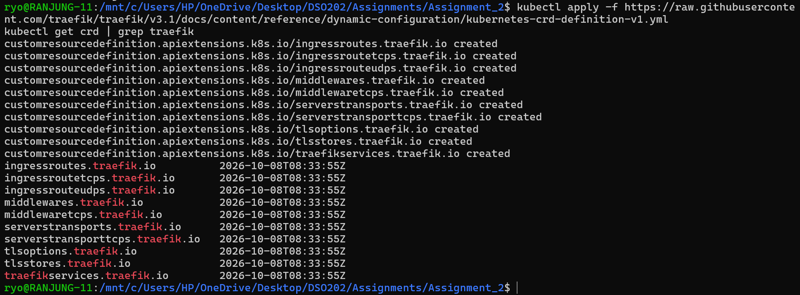

**Step 2: Deploy the controller.** `traefik/rbac.yaml` gives the controller's ServiceAccount read access to Ingresses, Services, EndpointSlices, Secrets and Middlewares. `traefik/traefik.yaml` creates the IngressClass and the Traefik Deployment. The important part of the Deployment:

The `nodeSelector` and toleration solve the same problem that broke the NGINX install. I explicitly pin the controller to the control-plane node, which is the only node with ports 80/443 published by kind, and `hostPort` binds those ports on that node.

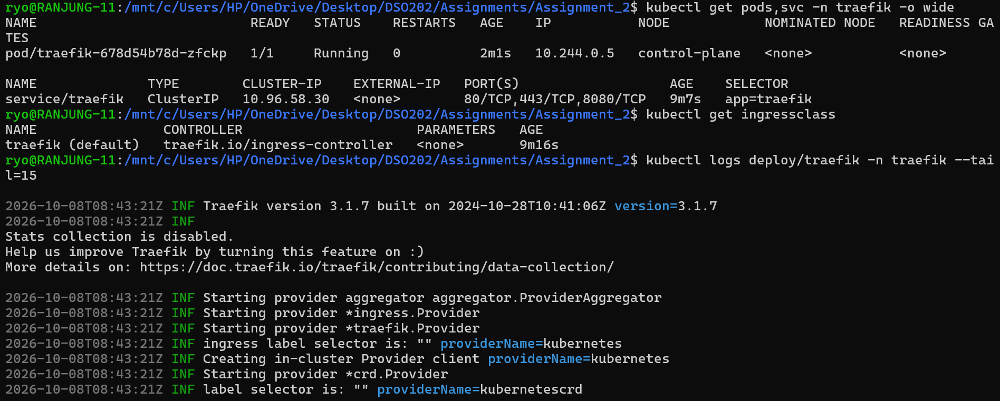

> The Traefik pod is `1/1 Running` on node **`control-plane`**. The IngressClass `traefik (default)` uses the controller `traefik.io/ingress-controller`. The logs show Traefik 3.1.7 starting both providers: `*ingress.Provider` (standard Ingress) and `*crd.Provider` (Traefik CRDs).

---

## Task 6: Ingress Resource Configuration

### 6.1 TLS certificate 

I generated a self-signed certificate valid for both hostnames using a Subject Alternative Name, and stored it in a `kubernetes.io/tls` Secret:

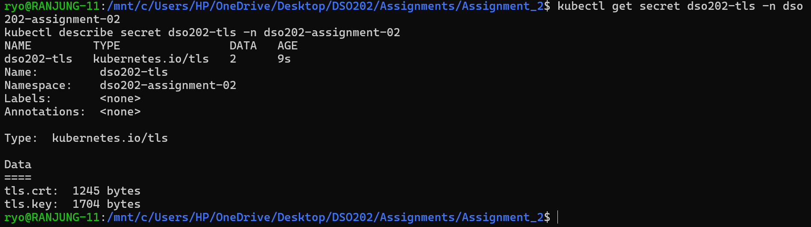

> The secret `dso202-tls` is of type `kubernetes.io/tls` and contains `tls.crt` and `tls.key`. The Secret must be in the same namespace as the Ingress that references it.

### 6.2 The Ingress manifest

`Ingress/ingress.yaml` contains two Ingress objects. The main one (`dso202-ingress`) on the HTTPS entrypoint:

The second one (`dso202-ingress-http`) uses the same hosts on the `web` (HTTP) entrypoint, with the `redirect-https` middleware.

**How each feature works:**

- **Basic routing rules (2.2.1.1):** On `app.dso202.local`, the request path decides the backend: `/api…` goes to `backend-svc` and everything else to `frontend-svc`. Traefik gives priority to the longer, more specific rule, so `/api` wins over `/`.
- **TLS termination (2.2.1.2):** The browser's HTTPS connection ends at Traefik, which decrypts it with the certificate from `dso202-tls` and forwards plain HTTP to the pods on port 8080. The application containers need no certificate or TLS configuration.
- **Name-based virtual hosting (2.2.1.3):** Both hostnames resolve to the same IP (`127.0.0.1`) and the same port (443). Traefik selects the rule using the `Host` header (and SNI for TLS): `app.dso202.local` serves the full application and `api.dso202.local` serves only the API.

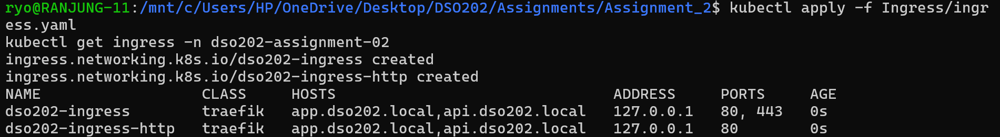

> Both Ingresses use class `traefik` and serve the hosts `app.dso202.local,api.dso202.local`. The ADDRESS is `127.0.0.1`, published by Traefik through `ingressendpoint.ip`. `dso202-ingress` lists ports `80, 443` because it has a `tls` section. `dso202-ingress-http` is on port 80 only.

### 6.3 Hostname resolution

Both hostnames point to `127.0.0.1`. I added this line to the Windows hosts file (`C:\Windows\System32\drivers\etc\hosts`) for the browser, and to `/etc/hosts` in WSL for `curl`:

```
127.0.0.1    app.dso202.local api.dso202.local
```

---

## Task 7: Controller-Specific Annotations 

The standard Ingress API only describes hosts, paths, backends and TLS. Features such as choosing an entrypoint, redirecting HTTP to HTTPS or adding response headers are **controller-specific**, so they are configured with annotations that only Traefik understands:

| Annotation | Value | Purpose |
|---|---|---|
| `traefik.ingress.kubernetes.io/router.entrypoints` | `websecure` / `web` | Which Traefik entrypoint (port) the router listens on |
| `traefik.ingress.kubernetes.io/router.tls` | `"true"` | Enable TLS on this router |
| `traefik.ingress.kubernetes.io/router.middlewares` | `<namespace>-<name>@kubernetescrd` | Attach Traefik Middleware CRDs to the route |

The Middlewares are Traefik CRD objects (`Ingress/middleware.yaml`):

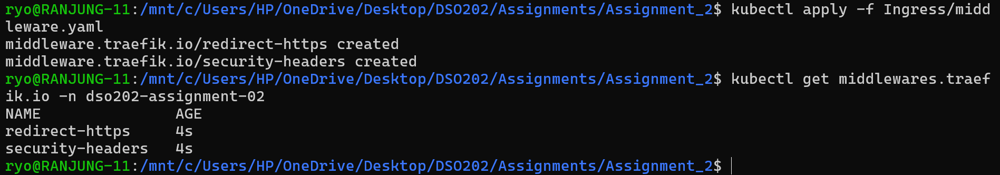

> Both Middlewares (`redirect-https` and `security-headers`) exist in the application namespace and are referenced by the Ingress annotations as `dso202-assignment-02-redirect-https@kubernetescrd` and `dso202-assignment-02-security-headers@kubernetescrd`.

---

## Task 8: Testing the Ingress

### 8.1 Virtual host `app.dso202.local` serves the frontend

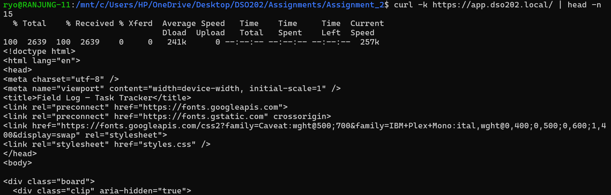

> Requesting `https://app.dso202.local/` over HTTPS (port 443) returns the HTML of the *Field Log – Task Tracker* frontend. The request went through TLS termination at Traefik and then the `/` rule of the `app.dso202.local` host to `frontend-svc`.

### 8.2 Path-based routing

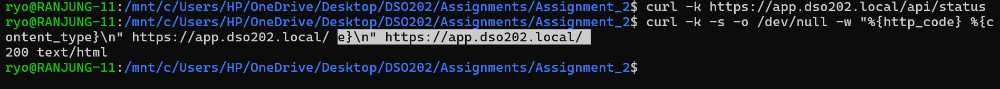

> The path `/` on `app.dso202.local` returns `200 text/html`, the frontend page.

### 8.3 End-to-end in the browser

I opened **https://app.dso202.local** in the browser. Because the certificate is self-signed, the browser shows a warning and marks the page as **"Not Secure"**. After I accepted it, the application loaded through the Ingress:

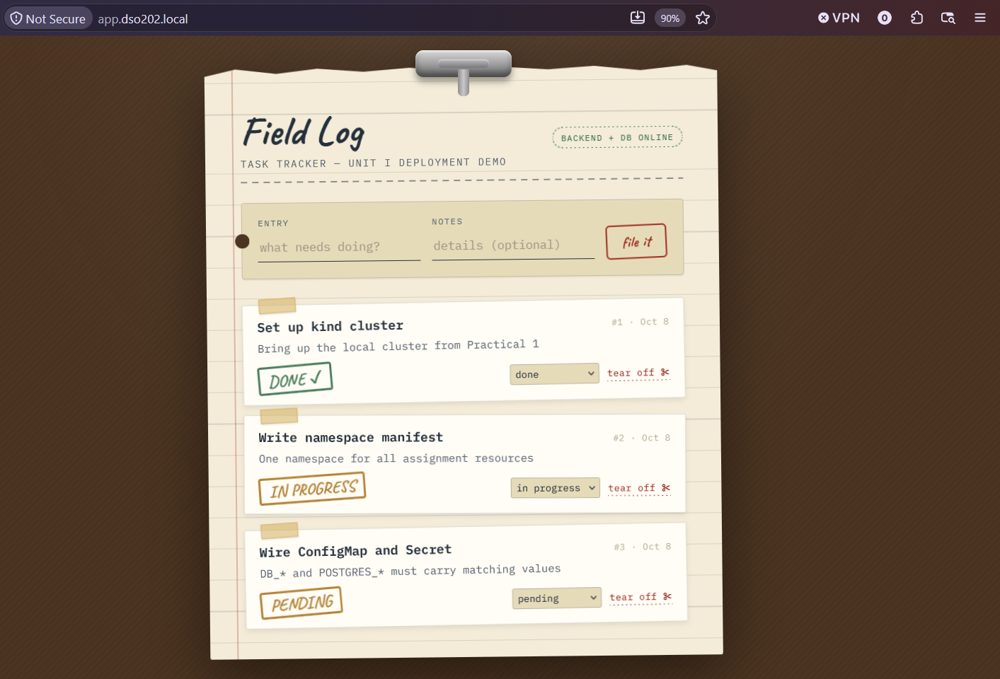

> The page is served from `app.dso202.local` over HTTPS through Traefik. The status pill shows **BACKEND + DB ONLINE**: the frontend called `/api/status` on the same host, the Ingress routed it to `backend-svc`, and the backend reached PostgreSQL at `db-0.db-headless`. The three seed tasks are loaded from the StatefulSet's database.

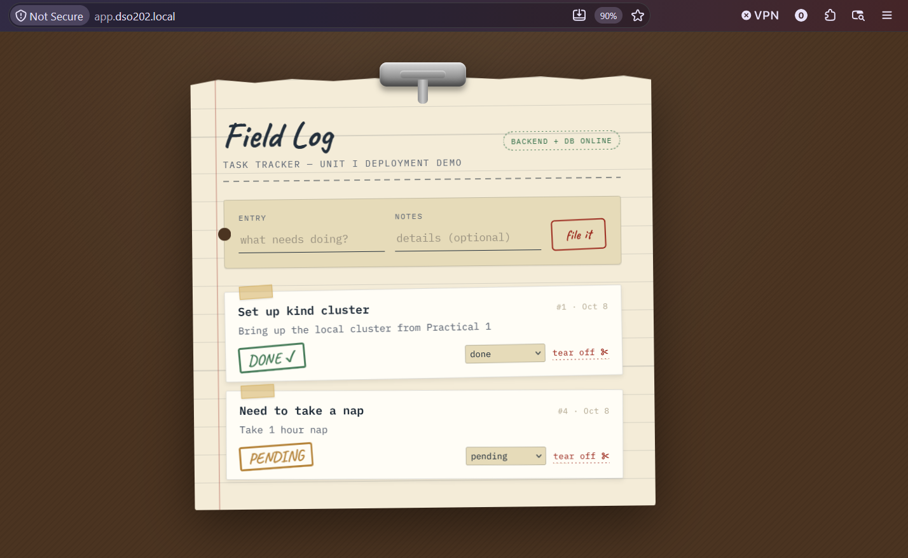

> I then tested the full CRUD flow through the Ingress. I created a new task (**#4 "Need to take a nap"**) and deleted tasks #2 and #3. Every action is a `POST`/`DELETE` request to `https://app.dso202.local/api/tasks`, which the `/api` rule routes to the backend. Task 1 keeps its status, and the new task got id 4, which shows the database sequence continued in the persistent volume.

---

## Task 9: StatefulSet Persistence: Deleting the Pod

To prove that the StatefulSet gives a stable identity and stable storage, I deleted the database pod and watched the controller recreate it:

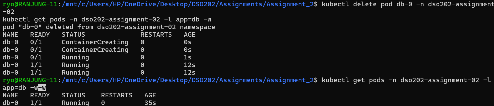

> The StatefulSet controller immediately recreated the pod with the **same name `db-0`**. A Deployment would have created a pod with a new random name. The new pod was `1/1 Running` after about 12 seconds.

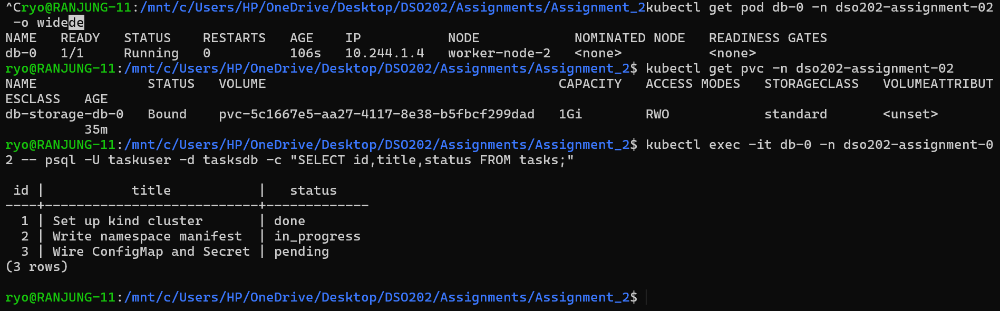

> The pod's **IP changed** from `10.244.1.3` to `10.244.1.4`, but this does not matter, because clients use the DNS name `db-0.db-headless`, which now points to the new IP. The pod re-attached to the **same PVC `db-storage-db-0`**, bound to the same volume `pvc-5c1667e5-…` seen in Task 3. All rows are still in the `tasks` table, so the data outlived the pod.

---

## Task 10: Ordered Deployment and Scaling

### 10.1 Scaling up: 1 → 3

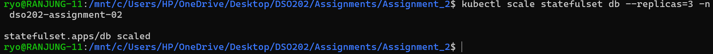

In a second terminal I watched the pods:

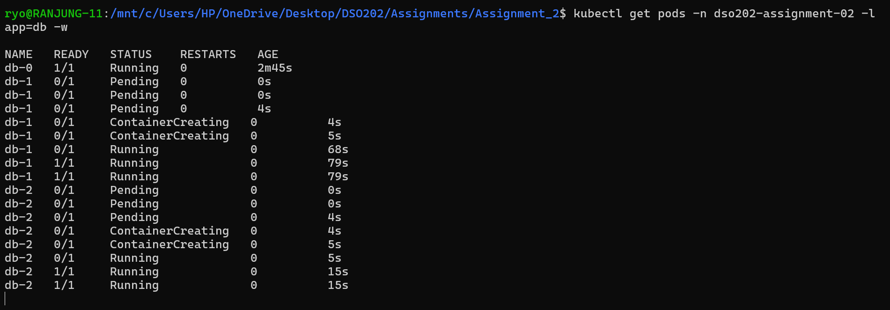

> This shows the `OrderedReady` policy. **`db-1`** was created first and went through `Pending` → `ContainerCreating` → `Running 0/1` → `Running 1/1`. Only **after `db-1` became Ready (1/1)** did the controller create **`db-2`**. The pods were never started in parallel.

### 10.2 Ordered rolling update

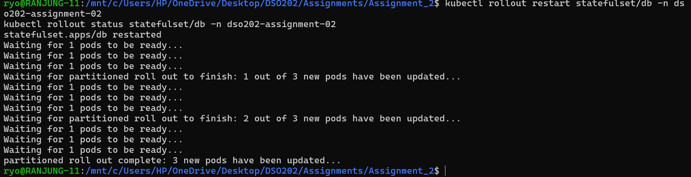

> The update replaced the pods **one at a time** ("1 out of 3", "2 out of 3", "3 new pods have been updated"). Each time, it waited for the replaced pod to be Ready before moving on. A StatefulSet rolling update goes in reverse ordinal order (`db-2` → `db-1` → `db-0`), so the primary instance `db-0` is updated last.

### 10.3 Scaling down: 3 → 1 and volume retention

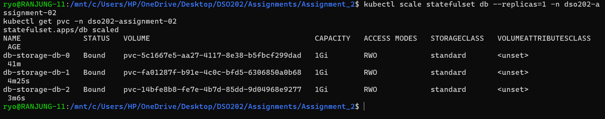

> Scaling down removes pods in **reverse order** (`db-2` first, then `db-1`). The PVCs **`db-storage-db-1` and `db-storage-db-2` are still `Bound`**: the volume claim template created one PVC per pod, and `persistentVolumeClaimRetentionPolicy.whenScaled: Retain` keeps them after the pods are removed. If I scale up again, `db-1` and `db-2` re-attach to their own old volumes.

> **Note:** `db-1` and `db-2` are independent PostgreSQL instances, not replicas of `db-0`. A StatefulSet gives each pod a stable identity and its own storage, but replicating data between them needs database-level replication (for example PostgreSQL streaming replication or an operator). The backend always connects to `db-0.db-headless`, which is why the stable identity of `db-0` matters.

---

## Reflection

**What I learned about StatefulSets**

Before this assignment, I thought a Deployment was enough for everything. In Assignment 1 my database ran as a Deployment and it worked, so I did not see a problem. Now I understand the difference. A Deployment treats all pods as the same: if a pod dies, the new one gets a random name and Kubernetes does not care which pod is which. That is fine for the frontend and backend, because they do not keep any data.

A database is different. It keeps data, and other parts of the app need to find it by a name that does not change. With a StatefulSet, my database pod is always called `db-0`, it always has the DNS name `db-0.db-headless`, and it always gets back its own disk (`db-storage-db-0`). When I deleted the pod, I saw this happen: the new pod had a different IP address, but the same name, the same disk, and all my tasks were still there. Seeing it with my own eyes made the idea much clearer than just reading about it.

I also learned why the **headless Service** is needed. A normal Service gives one IP address and spreads the traffic across all pods. A headless Service (`clusterIP: None`) does not do that. Instead, it gives every pod its own DNS name, which is exactly what a database needs. And with **volumeClaimTemplates**, I did not have to write a PVC file by hand. The StatefulSet created one disk for each pod automatically, so when I scaled up to 3 pods, I got 3 disks.

The scaling test showed me **ordered deployment** in action. `db-2` did not start until `db-1` was fully ready, and when I scaled down, the pods were removed in reverse order. The disks of the removed pods were kept, so no data was lost. I also understood that a StatefulSet does **not** copy data between pods: `db-1` and `db-2` were separate, empty databases. Real replication has to be set up inside PostgreSQL itself.

**What I learned about Ingress**

In Assignment 1, I opened the frontend with a NodePort (port 30080) and used port-forwarding for testing. That works, but in a real system you cannot open a new port for every service. With Ingress, there is **one entry point** (ports 80 and 443), and the Ingress Controller decides where each request should go:

- by **path**: `/api` goes to the backend and everything else goes to the frontend,
- by **hostname**: `app.dso202.local` and `api.dso202.local` use the same IP and port but reach different services,
- with **TLS**: HTTPS is handled by Traefik, so my application containers did not need any certificate.

I also learned that an Ingress object is only a set of rules. Nothing happens until an **Ingress Controller** is running to read those rules. Features that the standard Ingress does not have, like redirecting HTTP to HTTPS or adding security headers, are added with **annotations** that only that controller understands. That is why my annotations start with `traefik.ingress.kubernetes.io/`.

**Challenges I faced**

The hardest part was setting up the Ingress Controller. My first try with the NGINX Ingress Controller failed twice: first the pod could not be scheduled because my node did not have the `ingress-ready=true` label, and then a webhook secret was missing. I moved to Traefik, and I learned that on kind the controller has to run on the control-plane node, because that is the only node where ports 80 and 443 are opened to my computer. I fixed this with a `nodeSelector`, a toleration and `hostPort`.

I also made some small mistakes that took time to find:

- My `DB_HOST` was `db-0.db-svc`, but my headless Service was called `db-headless`, so the backend could not connect to the database. The pod name and the Service name must match exactly.
- The frontend was calling `/api/api/tasks` because the `/api` part was added twice.
- I applied the Traefik Deployment before its ServiceAccount, so the pod was never created. Running `kubectl describe` on the ReplicaSet showed me the exact error.
- I had many old and duplicate YAML files from earlier attempts, which made it confusing to know which file was really being used. Cleaning them up made the project much easier to follow.

From these problems, I learned to always check `kubectl describe` and `kubectl logs` first, because the error message usually tells you exactly what is wrong.

Overall, this assignment helped me understand **why** Kubernetes has different objects for different jobs: Deployments for apps that do not keep data, StatefulSets for apps that do, and Ingress for bringing outside traffic into the cluster in a clean and secure way.

---

## Conclusion

In this assignment, I re-implemented the Assignment 1 Task Tracker using the Unit 2 concepts:

- The **database** now runs as a **StatefulSet**. It has a stable pod name (`db-0`), a stable DNS identity through a **headless Service** (`db-0.db-headless`) and its own PersistentVolumeClaim created by **volumeClaimTemplates**. Deleting the pod showed that it comes back with the same name, the same volume and the same data. Scaling showed that pods are created strictly in order (`db-1` Ready before `db-2`), updated one at a time and removed in reverse order, while their volumes are retained.
- The **Traefik Ingress Controller** replaced the NodePort as the single entry point to the application. One Ingress provides **path-based routing** (`/api` vs `/`), **TLS termination** with a self-signed certificate, and **name-based virtual hosting** (`app.dso202.local` and `api.dso202.local` on the same IP and port). **Traefik annotations** add controller-specific features: entrypoint selection, TLS, an HTTP→HTTPS redirect and security headers through Middleware CRDs.

The application works end to end in the browser at `https://app.dso202.local`: frontend, backend and the StatefulSet database all communicate through the Ingress and the stable DNS name.
