## DSO202: Practical 2 Report

## Implementing Persistent Storage for a Stateful Application in Kubernetes

## AIM 

The aim of the practical is to implement and evaluate persistent storage for stateful applications in kuernetes and to understand the role of StatefulSets in managing stateful applications.

## Objective

The main objective of the practical are:
1. **Storage:** Learn how Persistent Volumes (PVs), Persistent Volume Claims (PVCs) and storage classes work in Kubernetes to provide persistent storage for stateful applications. It covers both the static provisioning and dynamic provisioning of storage resources.
2. **StatefulSets:** Learn why StatefulSets are better than Deployments for stateful applications. A statefulSets gives each Pod a fixed name, its own persistent storage, and a stable network identity.

## Environment

| Component | Version/Detail |
|---|---|
| Operating system | Linux (WSL2 backend used where applicable) |
| Docker Engine / Docker Desktop | 28.1.1 |
| kind | v0.32.0 (go1.24.4, linux/amd64) |
| kubectl (client) | v1.36.0 |
| Kustomize (bundled with kubectl) | v5.7.1 |
| Kubernetes cluster version | v1.36.1 |
| Cluster topology | 1 control-plane node + 2 worker nodes |
| Container runtime | containerd 2.1.4 |
| CNI | kindnet (default) |
| Default StorageClass provider | local-path-storage (added by kind) |

## Procedure and Observations

### Stage 0: Prerequisites and Verification

**What was done**

In this step, I have verified that all the necessary tools and resources are available for the practical.

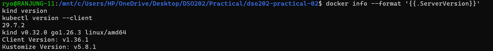

All the tools are installed and the version are latest.

Then I have created a host directory for statically provisioned storage for stage 2. The directory must exist before the cluster is created, because kind mounts it into a node at creation time.

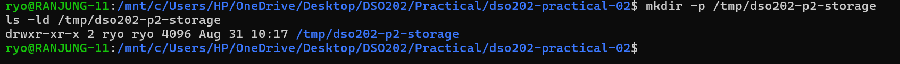

### Stage 1: Cluster, Namespace, and the Storage Landscape

**Create the cluster**

**What was done**

Here, I have created a cluster using the kind-cluster.yaml configuration file. 

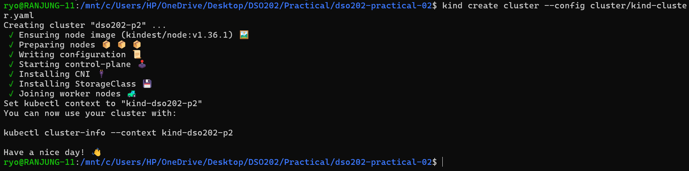

A cluster named `dso202-p2` is created with one control plane node and two worker nodes.

When creating the cluster, I have observed that the StorageClass was installed automatically, in the same way it installs a CNI plugin.

**Verify the cluster**

Then verified the cluster by checking the nodes and pods.

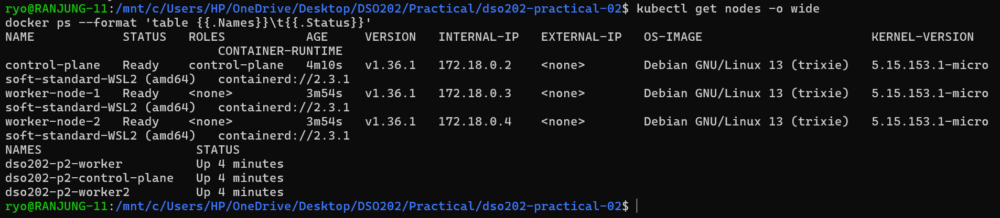

All the nodes are in Ready state and all the pods are running.

Confirms that the host directory reached the intended node.

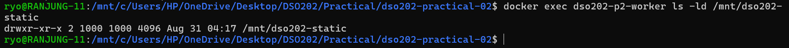

**Create the namespace, the quota, and the retaining StorageClass**

In this step, I have created a namespace, the quota, and the retaining StorageClass. All the configurations are defined in the manifest files. Since It is the declerative approach, I have applied the manifest files using the `kubectl apply` command.

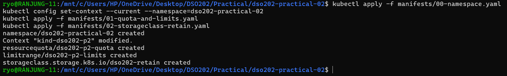

Then checked or inspected the created resources.

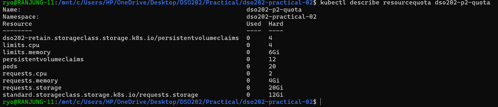

**Locate the provisioner**

I also checked the StorageClasses and the provisioner that is used by the default StorageClass.

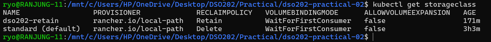

I have found out that the provisioner is `rancher.io/local-path` which is a local-path provisioner that uses hostPath volumes to provide persistent storage. 

Found two StorageClasses, one is the default StorageClass with a Delete policy and `dso202-retain` with a Retain policy. Both use WaitForFirstConsumer, which means the storage is created after the Pod is scheduled.

Find the provisioner Pod. It runs in its own namespace, not in the practical namespace.

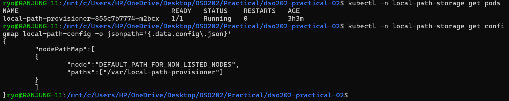

From the second result, I have observed that dynamically created storage is stored under `/var/local-path-provisioner` on the node where the Pod runs.

### Stage 2: Static Provisioning and Retain Policy

**Create the PersistentVolume**

I created a PersistentVolume (PV) called `pv-web-static` using the manifests/03-pv-static.yaml file on worker-node-1.

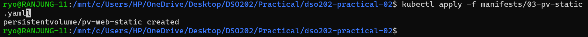

Created successfully.

Read the two fields that constrain scheduling.

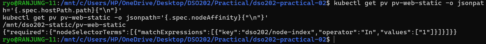

Node affinity was used to make sure the PV could only be used on that node.

**Claim it and write to it**

Then created a PersistentVolumeClaim (PVC) called `pvc-web-static` using the manifests/04-pvc-static.yaml file to use the PV.

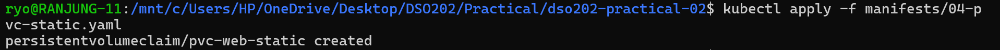

Checked the match rules by asking what the claim received.

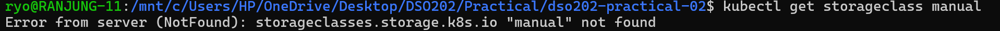

Then applied the listing 7 manifest to create a static-writer Pod that uses the PVC to write to the PV.

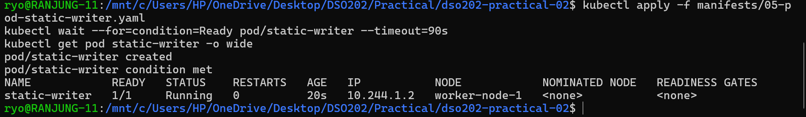

The Pod is on worker-node-1, and no nodeSelector was written into Listing 7. The volume placed it there.

**Prove the volume outlives the Pod**

I delete the Pod, recreate it, and read the file again.

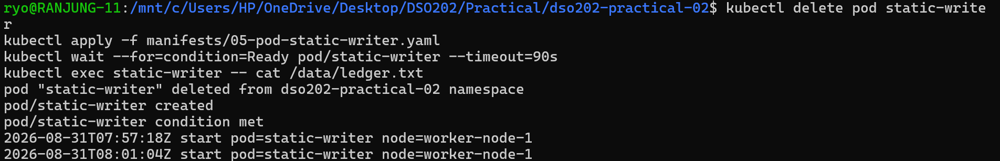

**Delete the claim and observe Released**

Then I deleted the Pod and then the claim, and watch the phase of the PV.

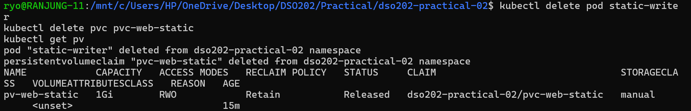

Confirm that the data is untouched, then remove the PV object.

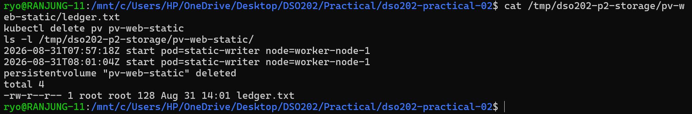

When I deleted the PVC, the PV changed to Released instead of Available. This happened because the Retain policy keeps the existing data and does not automatically make the PV available to a new claim. 

Finally, I deleted the PV object and found that `ledger.txt` was still present on the host. This showed that a PV is only a Kubernetes object that describes the storage; deleting the PV does not necessarily delete the actual data.

After all this, I recreated all three objects and read the file one final time.

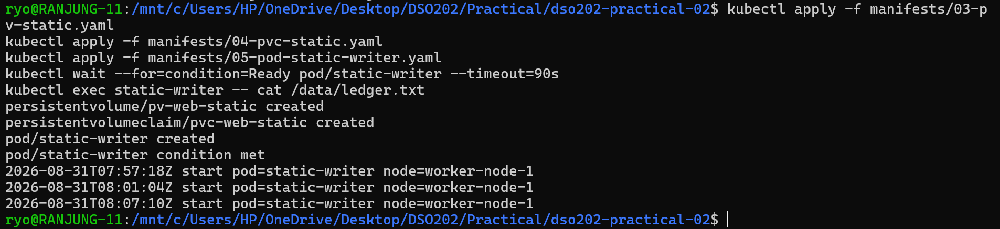

### Stage 3: Dynamic Provisioning, StorageClasses, and Two Uncomfortable Truths

**What this stage does**

In this stage, it demonstrates how kubernetes can automatically create storage when a Pod requests it. I have created a PVC named `dynamic-data` using the standard StorageClass. Since no Pod was using the PVC, it remained in the Pending state.

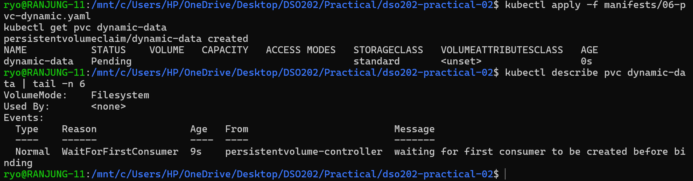

After the dynamic-writer Pod was created, Kubernetes automatically created a PV and connected it to the PVC.

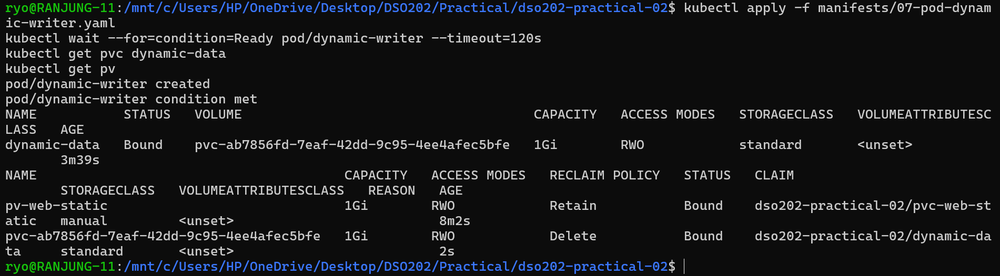

The result shows that the standard StorageClass uses WaitForFirstConsumer. This means Kubernetes waits until a Pod is created before deciding where to create the storage. The automatically created PV was given a name beginning with pvc-, and its reclaim policy was Delete.

Then I checked which node the Pod was running on and then checked the storage directory on that node.

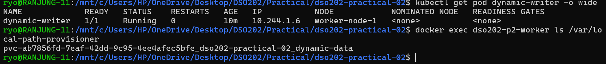

The directory was created automatically by the local-path provisioner. This shows that the dynamically created storage is stored on the node where the Pod is running.

**Check the storage size**

I checked the size of /data inside the Pod.

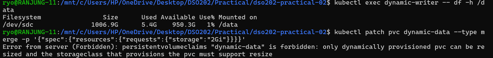

Although the PVC requested 1Gi, the container showed about 58 GB of available space. This shows that the local-path provisioner does not enforce the requested storage size.

In the above second command I tried to increase the PVC from 1Gi to 2Gi. Kubernetes rejected the request because storage expansion was disabled in the StorageClass.

**Delete the Pod and PVC**

I deleted the Pod and PVC and checked the PV and storage directory.

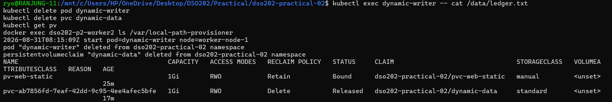

They were removed completely. This shows that the standard StorageClass uses the Delete reclaim policy, so the storage is deleted when the claim is removed.

**Stage 4: Why a Deployment Cannot Own State**

**What this stage does*

This stages shows the limitations of using a Deployment for applications that need persistent and separate data. A Deployment called shared-writer was created with three replicas, and all three Pods used the same PVC.

**Results**

First, I have created a Deployment with three replicas, and all three Pods used the same PVC. All three Pods were placed on worker-node-1. This shows that the shared RWO volume affected where the Pods could run.

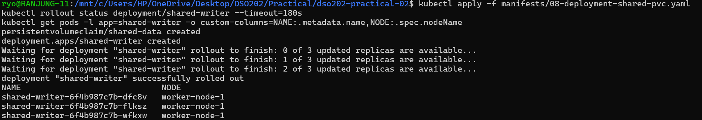

Then I checked the visitors.log file. The file contained entries from all three Pods. This shows that all replicas were writing to the same storage instead of having separate storage.

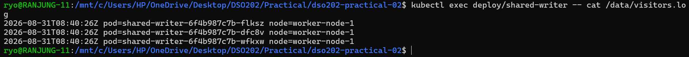

**Delete one Pod**

I deleted one of the Pods and Kubernetes created a replacement with a new random name.

The result shows that Deployment Pods do not have stable identities. This can be a problem for applications such as databases that need each instance to have a fixed identity.

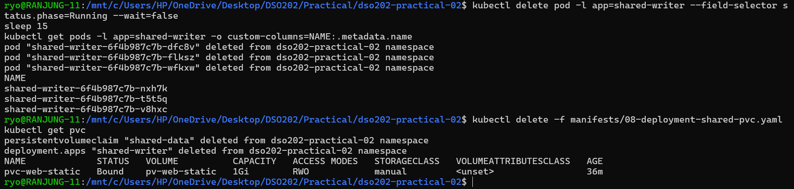

My observations is that in a cloud or multi-node environment, this type of configuration could cause a multi-attach error. This is the reason why a Deployment is not suitable for managing stateful data with one shared RWO volume

**OBSERVATIONS**

**Observation 1: Storage controls Pod placement**

All three replicas ran on worker-node-1 even though no node was selected. This happened because the PVC was connected to storage available only on that node. Therefore, the storage location controlled where the Pods could run.

**Observation 2: All replicas used the same data**

All three replicas wrote to the same visitors.log file on the same volume. This may work for a simple web server, but it is not safe for a database because multiple database instances could modify the same files and cause data corruption.

**Observation 3: Pod identity is not preserved**

When a Pod was deleted, it was replaced with a new Pod with a random name. There is no fixed identity for each replica. This is a problem for databases because database members need stable names to find and communicate with each other.

### Stage 5: StatefulSets and Stable Identity

First, I created the webnote headless Service before creating the StatefulSet.

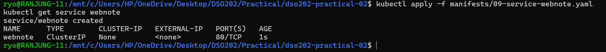

The Service had ClusterIP: None. This shows that the Service is used to provide DNS names for individual Pods instead of providing one virtual IP.

**Create the StatefulSet**

Then created a StatefulSet with three replicas.

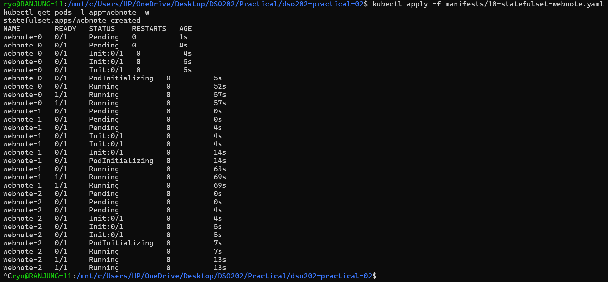

The Pods were created in order: webnote-0, webnote-1, and webnote-2.

Inspect the claims the controller created.

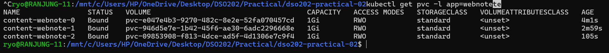

Confirm that placement is now free, because each Pod has its own volume

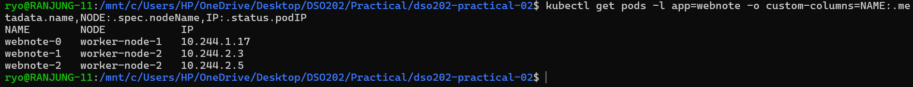

**Address individual Pods by name**

I started the client Pod from Listing 13 and resolved both DNS forms and fetched the page from one specific Pod..

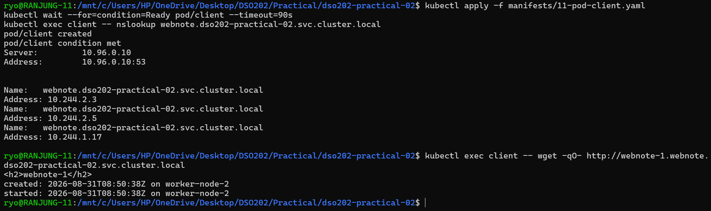

One name resolved to three addresses, and each address carries the name of the Pod that owns it.

**Prove the volumes are private**

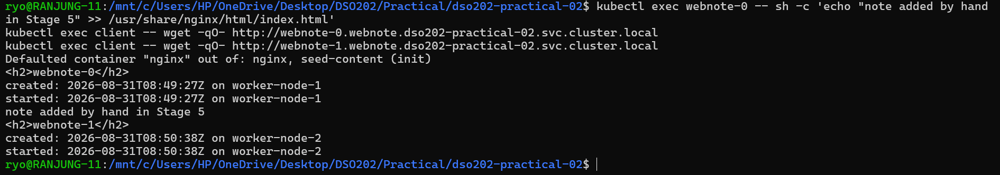

Three replicas of one workload, three different files.

**Prove that identity and storage survive deletion**

I deleted webnote-1. Kubernetes created another webnote-1 Pod and reused its existing PVC.

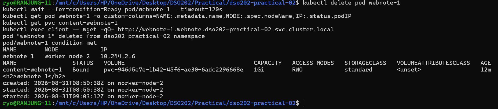

The IP address changed, but the Pod name and stored data remained. This shows that StatefulSets provide stable identity and persistent storage.

### Stage 6: Scaling, Retention, and Ordered Updates

**Scale up**

I increased the StatefulSet from 3 to 4 replicas. Kubernetes automatically created webnote-3 and its PVC. This shows that new StatefulSet replicas automatically receive their own storage.

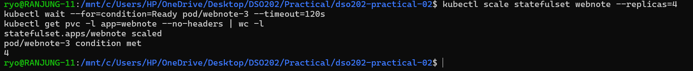

**Scale down**

I reduced the StatefulSet from 4 to 2 replicas. Kubernetes removed webnote-3 first and then webnote-2. This shows that StatefulSets remove Pods in reverse order.

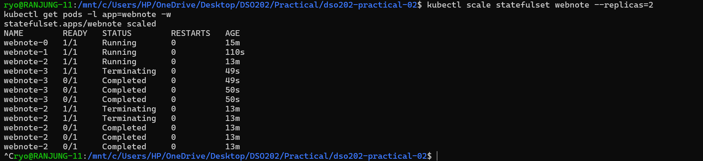

After scaling down, the PVCs for webnote-2 and webnote-3 were still present. This shows that the storage was retained even though the Pods were deleted.

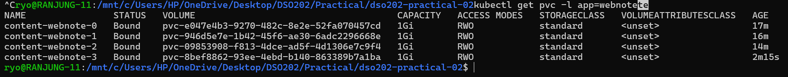

**Scale back up**

I increased the StatefulSet back to three replicas.

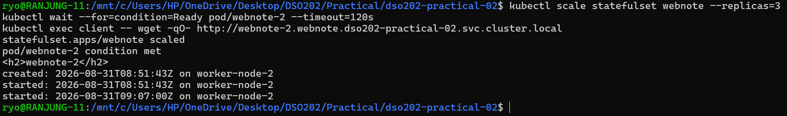

webnote-2 was recreated and reused its old PVC. This proves that the StatefulSet connects the same Pod identity with its original storage.

I changed the Nginx image from nginx:1.30-alpine to nginx:1.31-alpine and set the partition to 2.

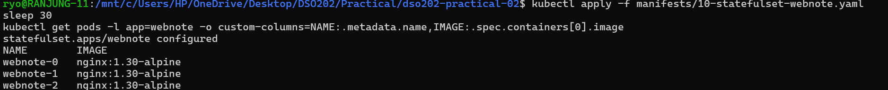

Only webnote-2 was updated.

I changed the partition to 0. The remaining Pods were updated one at a time. Their existing volumes were reused, so their data was not lost.

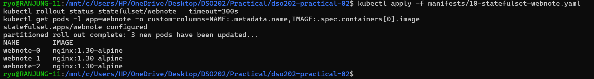

**Delete the controller, keep the data**

I deleted the StatefulSet and checked the Pods and PVCs. 

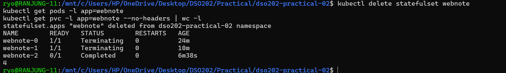

The Pods were deleted, but all four PVCs remained. This shows that the whenDeleted: Retain policy keeps the storage after the StatefulSet is deleted.

**Recreate the StatefulSet**

I created the StatefulSet again. The existing PVCs were reused and the previous data was still available. It shows that deleting and recreating the StatefulSet does not have to cause data loss when the storage is retained.

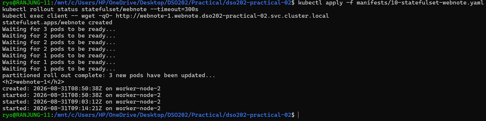

### Stage 7: A Real Stateful Application: PostgreSQL

**Credentials and Services**

I have created a Secret to store the PostgreSQL credentials. I also decoded the username to confirm its value. Then created two Services, postgres and postgres-headless. 

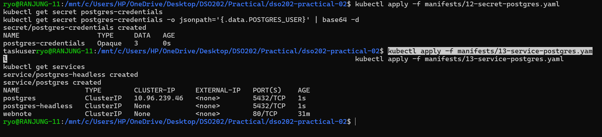

**Results**

This shows that Kubernetes Secrets are base64-encoded and not encrypted. The normal Service provides a stable name for applications to connect to PostgreSQL, while the headless Service provides a DNS name for the individual PostgreSQL Pod.

**Deploy PostgreSQL**

I deployed PostgreSQL as a StatefulSet with one replica.

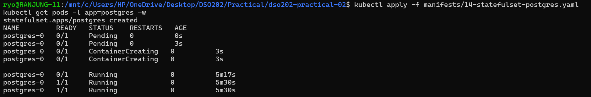

The Pod first showed Running and later became Ready. It shows that the readiness probe waits until PostgreSQL is fully ready before allowing traffic to reach it.

After that I checked the PostgreSQL logs and PVC. The database successfully started, and the PVC was using the dso202-retain StorageClass with a Retain policy.

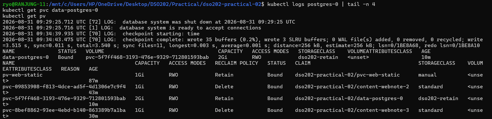

**Check the PostgreSQL data directory**

Checked the location of PGDATA.

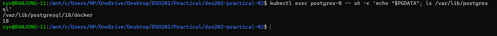

It was inside `/var/lib/postgresql/18/docker`.

**Create and store data**

I created a tasks table and inserted three records into PostgreSQL. The query returned all three records successfully. 

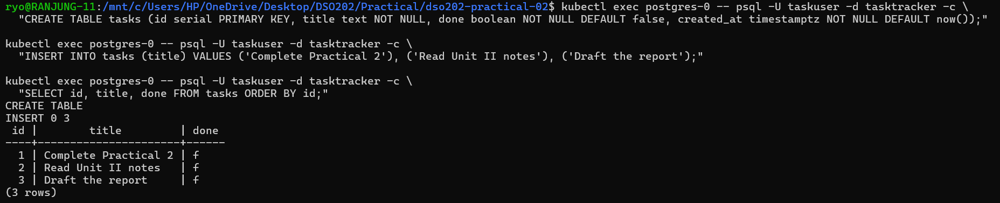

This shows that PostgreSQL was working correctly and the data was being stored on the persistent volume.

**Delete the PostgreSQL Pod**

Then deleted postgres-0 and waited for Kubernetes to create it again. After the replacement Pod started, I checked the number of records in the tasks table.

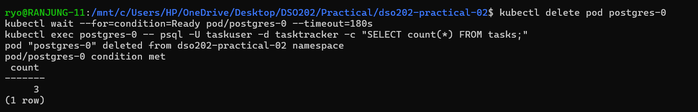

The result was 3 rows.

Also checked the PostgreSQL logs after the Pod was recreated. There was no new initialization message because PostgreSQL found the existing data.

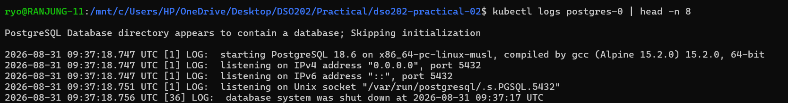

Finally, checked the PostgreSQL PVC and DNS names. The PVC remained the same after the Pod was replaced, and both the normal PostgreSQL Service and the individual Pod DNS name could be resolved. This shows that PostgreSQL has persistent storage and stable network names, even when its Pod is replaced.

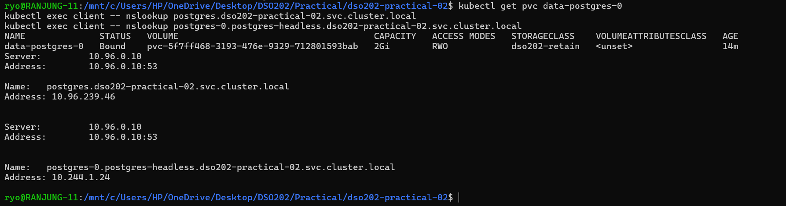

## Extension Tasks

### Extension 1: Make the retention policy destructive, on purpose.

In this task, I first copied the `manifests/10-statefulset-webnote.yaml` and set the `persistentVolumeClaimRetentionPolicy.whenScaled` to Delete, apply, scale from three replicas to one, and record what happens to the claims.

**Implementation and Results**

Changed the `whenScaled` to `Delete`:

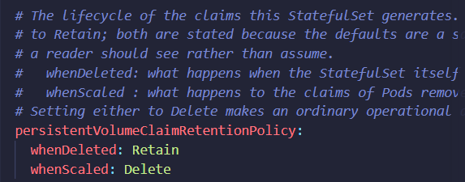

Then applied the manifest and confirmed the current state.

After that scaled the StatefulSet down to one replica and checked the PVCs.

Checked the claims. The two claims for webnote-2 and webnote-4 were deleted.

Retain is safer because scaling down a StatefulSet does not always mean that the data is no longer needed. If the default were Delete, scaling down could permanently delete the replica's volume and data. The data could be lost before an administrator confirms that it is safe to remove.

With Retain, the PVC remains after scaling down. This gives the administrator time to check the data and delete the claim manually if it is no longer needed.

Delete is more suitable for stateless or temporary data, such as a cache.

### Extension 2: Immutable field

In this task, First I copied the manifest file again and saved it as `10-statefulset-webnote-ext2.yaml` file.

After that I have added this line under `spec:` in that file.

Then applied the manifest but got an error.

This confirms that podManagementPolicy cannot be changed after a StatefulSet is created. The API server rejects any attempt to change it. The error message also shows the fields that can be changed later: replicas, ordinals, template, updateStrategy, revisionHistoryLimit, persistentVolumeClaimRetentionPolicy, and minReadySeconds. Other fields, such as podManagementPolicy, serviceName, and selector, can only be set when the StatefulSet is first created.

After that I have deleted the StatefulSet and recreated it with the new podManagementPolicy. The new value was accepted because it was set when the StatefulSet was first created.

Because podManagementPolicy can only be set when creating a StatefulSet, we had to delete and recreate it for the change to take effect. Unlike Stage 5, where Pods were created one after another, the recreated StatefulSet with Parallel created all three Pods at roughly the same time.

### Extension 3: Start the ordinals somewhere else.

In this task, I need to investigate the statefulset.spec.ordinals and confirm whether the field is available on this cluster version. And if it is I need to use it to make the replicas begin at ordinal 2.

**Implementation and Results**

First, I checked the field that exists on the cluster version first and then created a StatefulSet with ordinals starting at 2. In this file I have adde this.

Then cleaned the old claims first.

After that I have deleted the StatefulSet and applied the new manifest.

**Result:** The replicas were created as webnote-2, webnote-3, and webnote-4 instead of starting from webnote-0. Each replica also got a matching storage claim: content-webnote-2, content-webnote-3, and content-webnote-4.

This is useful when permanently removing older replicas, such as webnote-0 and webnote-1. Setting ordinals.start: 2 ensures new replicas start from webnote-2 and do not reuse the old names or storage.

## Analysis

*1. The claim in Stage 3 was Pending immediately after creation, while the claim in Stage 2 bound at once. Name the single field responsible for the difference and explain the reasoning behind that field's design.*

**Answer:**

The single field responsible for the difference is the `storageClassName` field in the PVC specification. In Stage 2, the PVC specified a StorageClass with a Retain policy, which caused it to bind immediately to a PV. In Stage 3, the PVC specified a StorageClass with a Delete policy, which caused it to remain Pending until a suitable PV was available.

*2. After the claim was deleted, the data from Stage 2 survived and the data from Stage 3 did not. State which object carried the field that decided this, and who in a real organisation would have chosen its value.*

**Answer:**

The StorageClass decides this through its `reclaimPolicy`. In stage 2, the StorageClass had a Retain policy, which means that when the PVC was deleted, the PV was not deleted and the data remained. In stage 3, the StorageClass had a Delete policy, which means that when the PVC was deleted, the PV was also deleted and the data was lost. In a real organization, the choice of reclaim policy would typically be made by a storage administrator or a DevOps engineer responsible for managing persistent storage in Kubernetes.

*3. In Stage 4 all three replicas were scheduled onto one node although the Deployment expressed no node preference. Explain the mechanism, and state what would have happened instead on a managed cloud cluster using a zonal disk.*

**Answer:**

The Deployment's three replicas are all mounted on the same PVC, which was bount to a PV that was only available on one node. The scheduler cannot place a Pod using that volume on any other node, because the volume simply isn't there.

On a managed cloud cluster using a zonal disk, the outcome would be worse. A network disk is normally ReadWriteOnce at the disk level, attachable to only one node at a time. Any replica scheduled to a different node would fail to start, reporting a multi-attach error.

*4. Give the fully qualified DNS name of the second replica of the webnote StatefulSet, and name every object that must exist for it to resolve.*

**Answer:**

The fully qualified DNS name of the second replica is:
`webnote-1.webnote.dso202-practical-02.svc.cluster.local`.

The second replica is webnote-1 because StatefulSet numbering starts from 0 (webnote-0, webnote-1, etc.).

For this DNS name to work, three things must exist:
1. Pod: webnote-1, The Pod must exist and be running to have a stable identity.
2. Headless Service: webnote, It must have `clusterIP: None` to allow DNS resolution of individual Pods.
3. StatefulSet: webnote, It's ServiceName must be set to webnote, linking the Pods to the headless Service.

*5. The StatefulSet was scaled from four replicas to two and back to three. Describe what happened to the claims at each step, name the two fields that governed it, and state their default values.*

**Answer:**

When the StatefulSet was scaled from 4 replicas to 2, webnote-3 and webnote-2 were stopped first because StatefulSet Pods are removed from the highest number first. However, their PVCs, content-webnote-2 and content-webnote-3, were not deleted. They remained Bound. This is controlled by persistentVolumeClaimRetentionPolicy.whenScaled, whose default is Retain

When the StatefulSet was scaled back up to 3 replicas, webnote-2 was recreated and reused its original PVC, content-webnote-2. The `whenDeleted` field also defaults to Retain, but it controls what happens to PVCs when the entire StatefulSet is deleted, rather than when it is scaled down.

*6. Listing 16 mounts the volume at /var/lib/postgresql rather than at the data directory. Explain why, and describe the failure that mounting at the data directory would produce on a volume that is not empty.*

**Answer:**

PostgresSQL 18 stores its actual database data in a subdirectory: `/var/lib/postgresql/18/docker.` The volume is mounted at /var/lib/postgresql, one level above the actual data directory. A newly created volume may already contain files such as lost+found or other storage metadata. If the volume were mounted directly at the data directory, PostgreSQL could fail to initialize.

By mounting at `/var/lib/postgresql`, PostgreSQL can create and manage its own 18/docker subdirectory safely.

*7. State two things a StatefulSet does not provide for a database, and name the Kubernetes mechanism or the software category that provides each in production.*

**Answer:**

The two things that a StatefulSet does not provide for a database are:
1. **Replication**: A statefulSet gives each Pod its own storage, but it does not copy data between the Pods. Database replication must be handled by the database itself, such as PostgreSQL replication, or by a database Operator.

2. **Backup**: A StatefulSet can keep data after a Pod is deleted, but this is not a backup. If the PVC or storage is deleted, the data can still be lost.

*8. After the claims were deleted in Stage 8, two PersistentVolumes reported Released. Explain why the phase was not Available, and state what an administrator must do to return that storage to service.*

**Answer:**

A PV with the Retain policy becomes Released after its PVC is deleted. Kubernetes does this because the volume may still contain the previous application's data. It does not automatically give the volume to another PVC because this could expose the old data to another application.

To reuse the PV, an adminsitrator must manually clean it up. They can either delete the PV if the old data is no longer needed, or remove the old claimRef from the PV and make it Available again for a new PVC to bind to it.

## Reflection

## References

- https://hackmd.io/@sarojsanyasi/dso202-practical-02

- https://hackmd.io/@sarojsanyasi/B1ZPV7oPMx

- 