# Practical 5: Environment-Specific Configuration with Kustomize on Kind

## Aim

To deploy one web application to several environments (dev, staging, prod and qa) using **Kustomize**. All environments share one set of base files. Each environment keeps only its own small changes.

## Objectives

- Understand the difference between a **base** and an **overlay** in Kustomize.
- Render (preview) the final Kubernetes files before applying them.
- Deploy dev, staging, prod and qa without copying the Deployment or Service files.
- See how a change in page content creates a new ConfigMap name and restarts the pods automatically.
- Use two kinds of patches: a **strategic merge patch** and a **JSON 6902 patch**.
- Follow a safe workflow: **render - diff - apply - verify**.

## Background

When an application runs in many environments, most of its settings are the same. Only a few things change, such as the number of replicas, the image version or the resource limits. If we copy the full YAML files for every environment, the copies slowly drift apart and become hard to maintain.

**Kustomize** solves this problem:

- The **base** holds the files that every environment shares (Deployment, Service and the default web page).
- Each **overlay** points to the base and adds only what is different for that environment.
- Kustomize joins the base and the overlay to produce the final files. We do not need to write any templates.

## Lab Setup

| Item | Details |
|---|---|
| Cluster | Kind cluster with 1 control-plane node and 2 worker nodes |
| Application | A small NGINX web server that shows one HTML page |
| Namespaces | `webapp-dev`, `webapp-staging`, `webapp-prod`, `webapp-qa` (plus `webapp-sandbox` for the challenge) |
| Tools | kubectl (with built-in Kustomize), Kind, Docker |

---

## Task 0: Pre-flight Checks

Before starting, I checked that the cluster was working. I confirmed that kubectl was connected to the Kind cluster, that all three nodes were **Ready**, and that my kubectl version includes Kustomize.

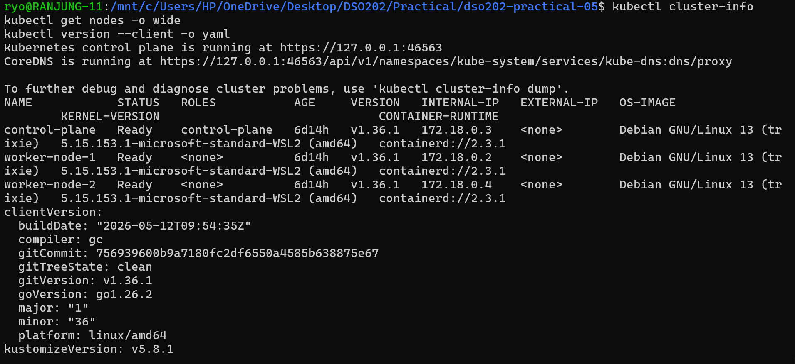

**Result:** The cluster was healthy and ready for the practical.

---

## Task 1: Understanding the Repository

The project has one `base` folder and one folder for each environment inside `overlays`.

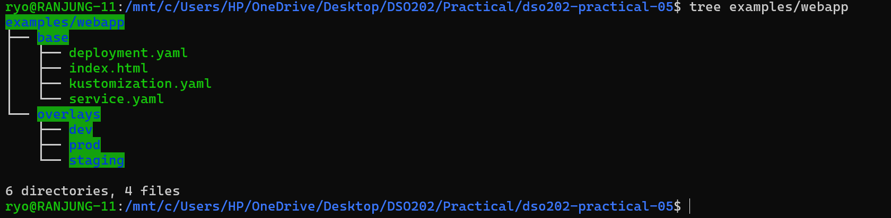

**1. Which files are shared by all environments?**
The files in the `base` folder: the Deployment, the Service, the base kustomization file and the default `index.html` page.

**2. Which values are different between environments?**
The namespace, the environment label, the number of replicas, the image tag, the web page content, the CPU and memory resources, and the annotations.

**3. Where do the differences live?**
Only inside each overlay folder. Every overlay has its own kustomization file, an `index.html` page, a namespace file and, when needed, a small patch file.

---

## Task 2: Rendering the Base

I rendered the base to see the final output without applying anything to the cluster.

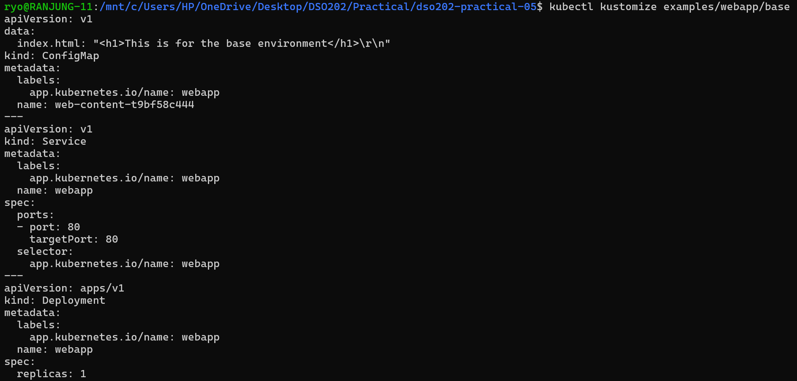

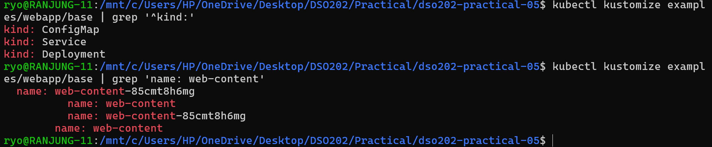

**Observations:**
- The base creates three resources: a **ConfigMap**, a **Service** and a **Deployment**.
- The ConfigMap is not named `web-content`. It is named `web-content-85cmt8h6mg`.
- Kustomize also updated the Deployment so that its volume now uses the new name `web-content-85cmt8h6mg`.

**Checkpoint: Why is the ConfigMap name not exactly `web-content`?**
The ConfigMap generator adds a short **hash** to the end of the name. This hash is calculated from the content of the ConfigMap. If the content changes, the hash changes, so the name changes too. Kustomize then updates the Deployment to use the new name. Because the Deployment has changed, Kubernetes starts new pods that show the new content. Without the hash, the old pods would keep showing the old page.

---

## Task 3: Comparing Dev and Prod

I rendered the dev and prod overlays into two files and compared them side by side.

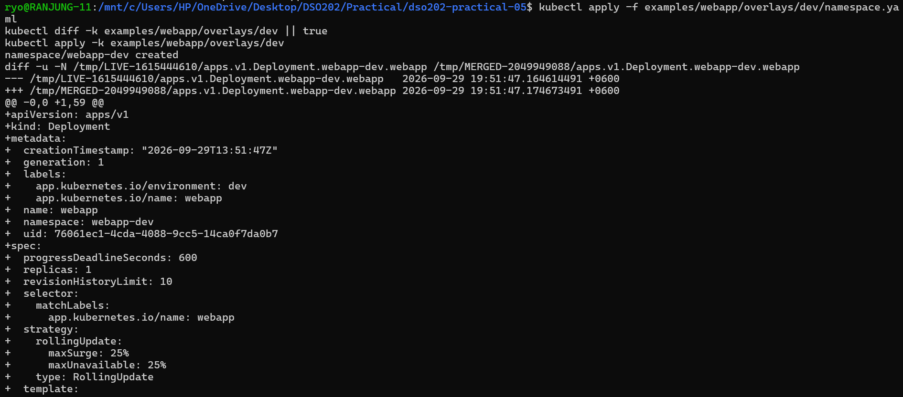

| # | What is different | Dev | Prod |
|---|---|---|---|
| 1 | Namespace | `webapp-dev` | `webapp-prod` |
| 2 | Environment label | `dev` | `prod` |
| 3 | Number of replicas | 1 | 3 |
| 4 | NGINX image | `nginx:1.25` | `nginx:1.25.5` |
| 5 | CPU request / limit | 50m / 100m | 200m / 500m |
| 6 | Web page and ConfigMap hash | Development page | Production page |
| 7 | Annotation | None | `training.example.com/tier: production` |

**What I learned:** The difference between the two environments is only a few lines, so it is easy to read and review. If we had copied the full files, we would have to compare two long files line by line to find the same changes.

---

## Task 4: Deploying Dev Safely

I followed the safe workflow for the dev environment:

1. **Render**: I previewed the final output first.
2. **Diff**: I checked what would change in the cluster.
3. **Apply**: I deployed the dev overlay.
4. **Verify**: I checked the resources, the ConfigMap and the rollout status.

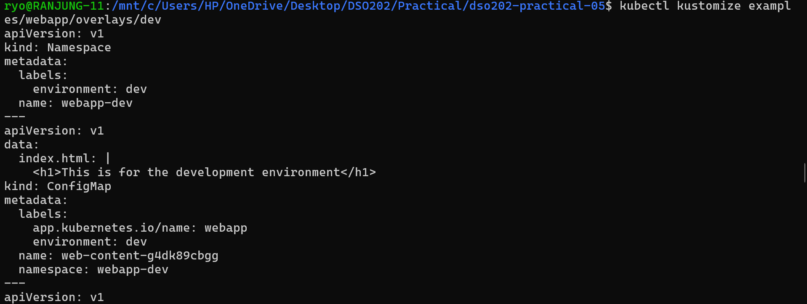

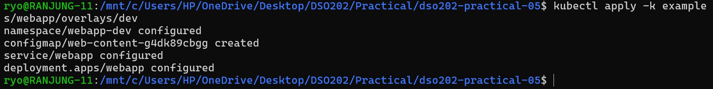

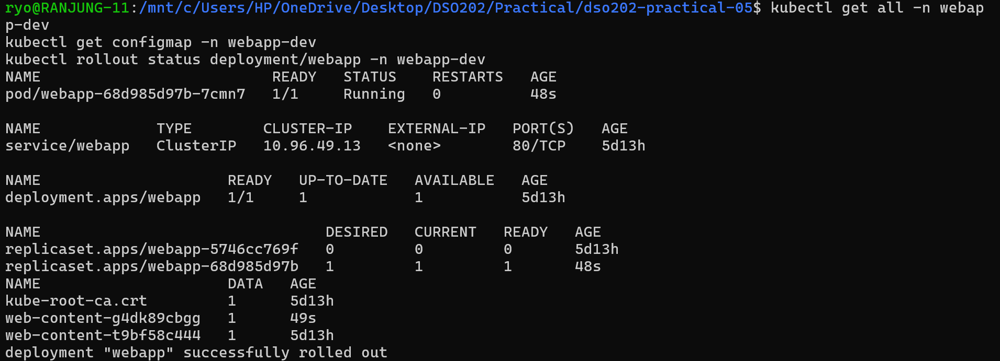

**Result:** The ConfigMap, Service, Deployment and pod were all created in the `webapp-dev` namespace. The Deployment keeps the base name `webapp`. The namespace is what keeps each environment separate.

---

## Task 5: Accessing the Application

I used port-forwarding to open the dev service on my own computer, and then sent a request to it.

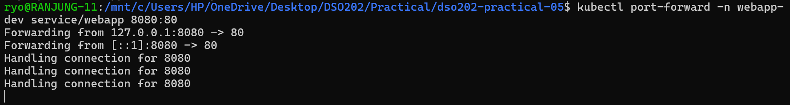

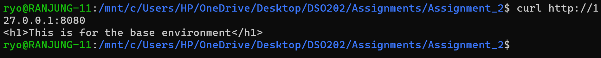

**Result:** The app replied with *"This is for the development environment"*. This shows that the dev overlay's own page was being served, not the base page. I stopped the port-forward after the test.

---

## Task 6: Proving the ConfigMap Hash and Rollout Chain

**Before the change:** I recorded the current ConfigMap and pod names.

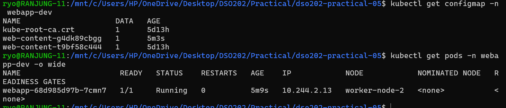

**The change:** I edited the dev web page to say *"DEV v2: configuration changed"*. Before applying, I rendered the overlay again and saw a new ConfigMap name. Then I applied it and waited for the rollout to finish.

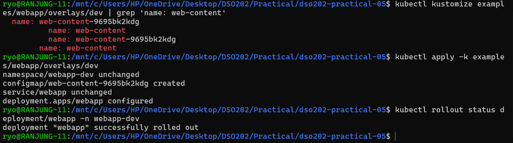

**After the change:** I checked the ConfigMap and pod names again.

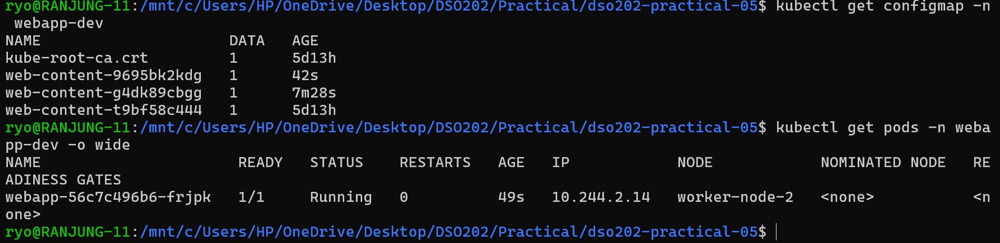

| | Before | After |
|---|---|---|
| ConfigMap | `web-content-g4dk89cbgg` | `web-content-9695bk2kdg` |
| Pod | `webapp-68d985d97b-7cmn7` | `webapp-56c7c496b6-frjpk` |

**How a content change leads to a rollout (in my own words):**
I only changed one HTML file. Because the content changed, Kustomize gave the ConfigMap a new hash and a new name. Kustomize also updated the Deployment to point to this new name. A change inside the Deployment's pod template tells Kubernetes to replace the old pods. So the old pod was removed and a new pod started with the new page. I did not have to restart anything by hand.

> File content changed → ConfigMap content changed → ConfigMap name changed → Deployment updated → New pods rolled out

---

## Task 7: Deploying Staging and Prod

I checked the diff and then applied the staging and prod overlays. After that, I listed the Deployments and pods in all namespaces.

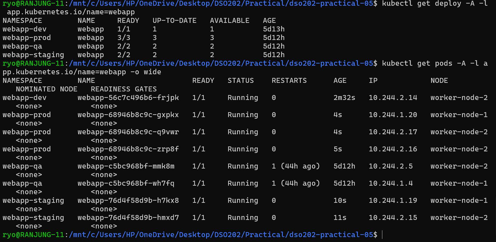

| Environment | Namespace | Replicas | Image |
|---|---|---|---|
| Dev | `webapp-dev` | 1 | `nginx:1.25` |
| Staging | `webapp-staging` | 2 | `nginx:1.25.5` |
| Prod | `webapp-prod` | 3 | `nginx:1.25.5` |
| QA | `webapp-qa` | 2 | `nginx:1.25` |

**Result:** Every environment runs the same application from the same base, but with its own replica count. The pods are spread across both worker nodes.

---

## Task 8: Inspecting the Prod Patch

The prod overlay uses a small patch file that changes only the CPU and memory resources of the NGINX container. It also adds a "production" annotation.

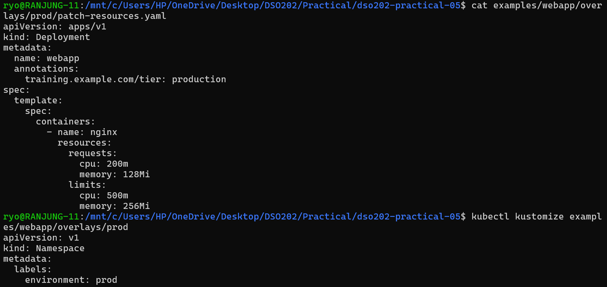

**1. Were the base values merged or replaced?**
They were **merged**. Kustomize found the container by its name (`nginx`) and changed only the resource values. Everything else from the base, such as the image, port and volume mount, stayed the same.

**2. Which environment owns the production resource policy?**
Only the **prod overlay** owns it. The base and the other environments are not affected.

**3. Why is a patch better than copying the Deployment file?**
A copied file does not follow later changes to the base. If someone adds a new port or a health check to the base, they would have to remember to add it to the copy too. A patch contains only the difference, so it stays small, easy to review and always in sync with the base.

---

## Task 9: Creating a QA Overlay

I created a new QA environment without copying any base files. It only contains the following four small files:

| File | Purpose |
|---|---|
| `kustomization.yaml` | Points to the base and sets the namespace `webapp-qa`, the label `environment: qa`, 2 replicas and a new web page |
| `namespace.yaml` | Creates the `webapp-qa` namespace |
| `index.html` | A unique page: *"This is for the QA environment (owner: qa-team)"* |
| `patch-annotation.yaml` | A JSON 6902 patch that adds the annotation `training.example.com/owner: qa-team` to the Deployment |

Before applying, I checked the rendered output to make sure the annotation was there. Then I ran the diff, applied the overlay and verified the Deployment.

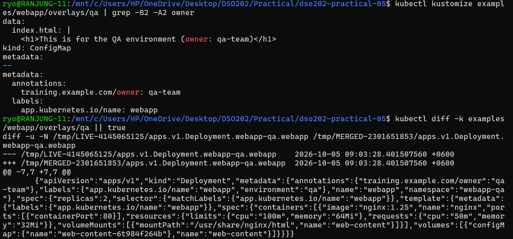

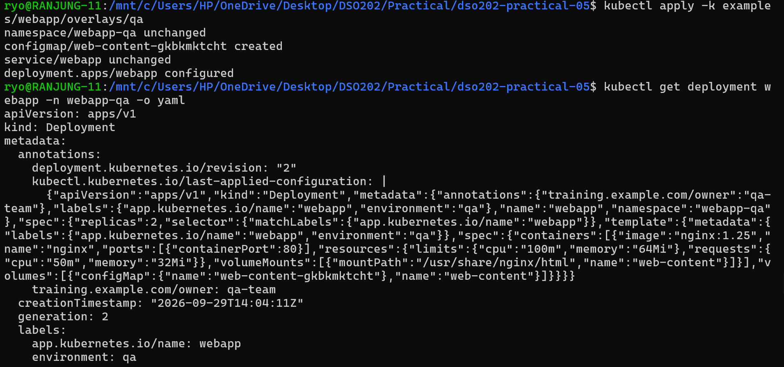

**Result:** The QA Deployment runs 2 replicas in `webapp-qa`, has the `environment: qa` label, shows the QA page and carries the `owner: qa-team` annotation.

### Strategic Merge Patch vs JSON 6902 Patch

| | Strategic Merge Patch (used in prod) | JSON 6902 Patch (used in QA) |
|---|---|---|
| What it looks like | A small piece of a normal Kubernetes file | A list of steps, each with an action, a path and a value |
| How it finds the target | From the kind and name written inside the patch | The target must be given in the kustomization file |
| How it handles lists | Matches list items by key, for example by container name | Points to an exact position in the file |
| Best used for | Changing or adding fields in a familiar layout | Exact actions such as add, remove or replace on one field |

The base Deployment had no annotations, so the JSON patch added the whole annotations section. If annotations already existed, it would be safer to add only the single owner key so that the other annotations are not overwritten.

---

## Challenge: Using `namePrefix` in a Sandbox Overlay

I created a sandbox overlay that adds the prefix `sandbox-` to resource names. Before rendering, I wrote down what I expected to change. Then I compared my prediction with the real output.

| Object or reference | My prediction | Actual result |
|---|---|---|
| Deployment name | `sandbox-webapp` | `sandbox-webapp` ✔ |
| Service name | `sandbox-webapp` | `sandbox-webapp` ✔ |
| ConfigMap name | `sandbox-web-content-<hash>` | `sandbox-web-content-bf64f96mh8` ✔ |
| ConfigMap name used inside the Deployment | Updated to the new name | Updated ✔ |
| Namespace | Not changed | `webapp-sandbox` ✔ |
| Container name and volume name | Not changed | Not changed ✔ |
| Labels and Service selector | Not changed | Not changed ✔ |

**What I learned:** Kustomize knows which fields refer to other resources. When it renamed the ConfigMap, it also updated the Deployment that uses it, so nothing broke.

---

## Reflection: A Mistake and How the Rendered Output Helped

In my first try at the dev overlay, I placed a new `index.html` inside the dev folder. I thought that would be enough to change the page. But I forgot to tell Kustomize to **replace** the base ConfigMap with this new file.

When I rendered the dev overlay, the output showed the problem clearly. The ConfigMap still said *"This is for the base environment"*, and the hash stayed the same (`web-content-t9bf58c444`).

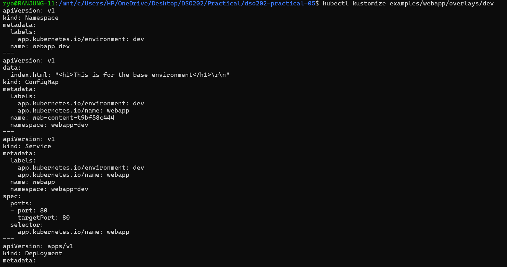

After applying, the ConfigMap and the pod stayed **unchanged**, which confirmed that my new page was being ignored.

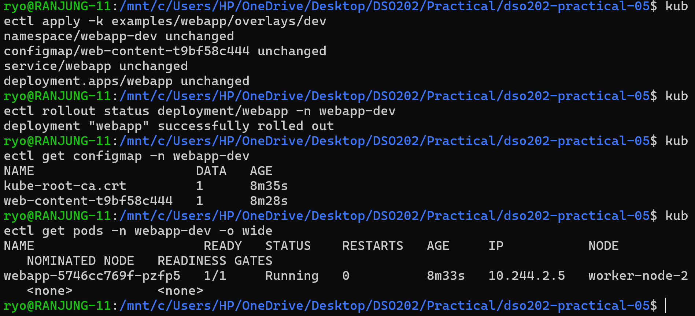

To fix it, I added a ConfigMap generator to the dev overlay with the **replace** behaviour. After that, the render showed the development page and a new hash. From this mistake I learned to **always render and check the output before applying**.

---

## Conclusion

In this practical, I used one base and a few small overlays to deploy the same web application to dev, staging, prod and qa without copying the Deployment or Service files. Each overlay contained only what was different, so the changes were easy to read and review. I saw how the ConfigMap hash turns a simple content change into an automatic rollout. I also learned when to use a strategic merge patch and when to use a JSON 6902 patch. Following the **render - diff - apply - verify** workflow helped me find mistakes before they reached the cluster.
