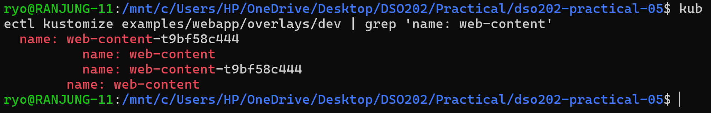

## Objectives

Render a base and multiple overlays (dev, staging, prod, qa, sandbox)
- Deploy every environment without copying the base
- Deployment or Service
- Use namespace, labels, replicas, images, configMapGenerator, and patches
- Observe the ConfigMap hash → rollout behaviour
- Follow the safe workflow: **render → diff → apply → verify**
- Diagnose problems from rendered output

### Task 0: Pre-flight

### Task 2: Render the base

### Task 3 — Compare dev and prod without touching the cluster

### Render before applying:

### Task 8 — Inspect what the prod patch changed