## Practical 6: Helm

### Stage 0: Install Helm and prepare the cluster

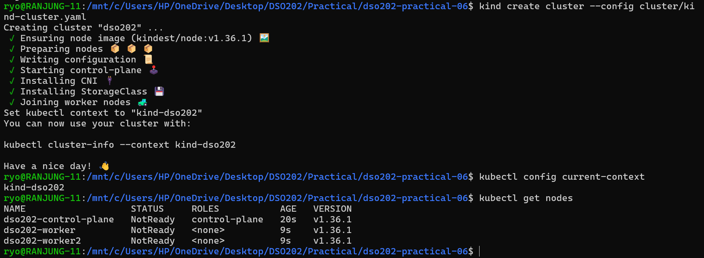

### Install Helm 4

I have installed Helm 4 already on my local machine. Just checked the version.

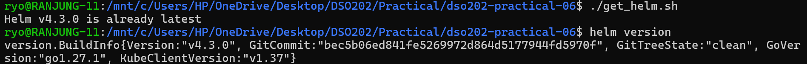

### Check Helm's config paths:

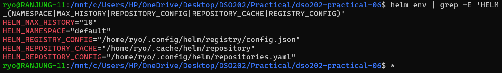

### Confirm Helm can reach the cluster

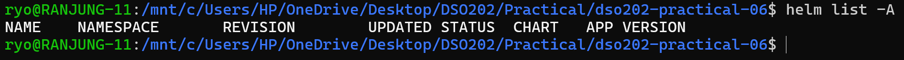

### Create the lab folder

## Stage 1: Use a published chart (podinfo)

### Add the repo and update it

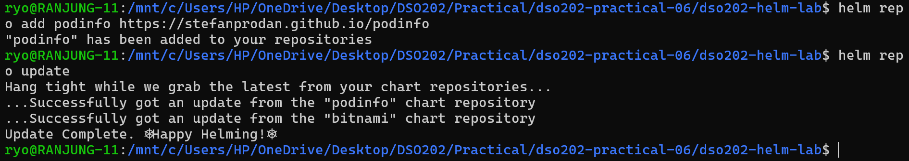

### Search

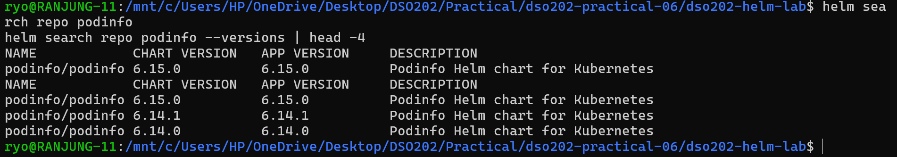

### Read the chart before installing:

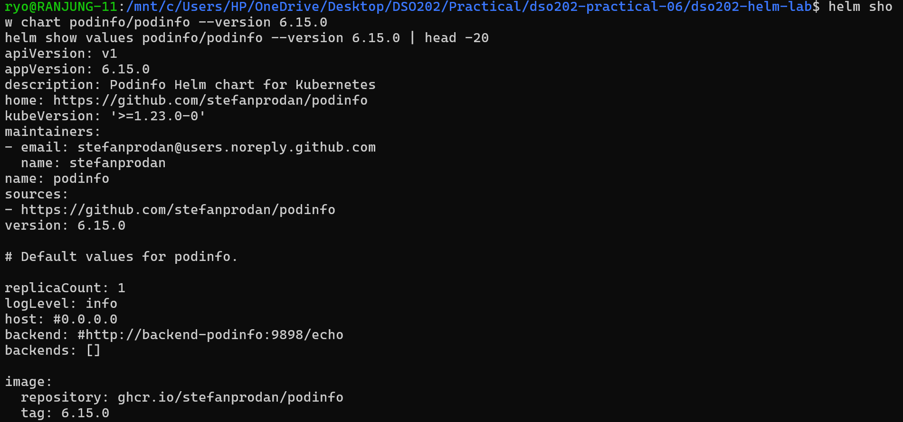

### Install

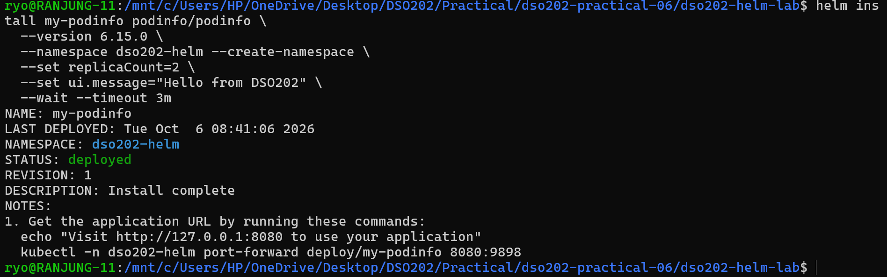

### List releases

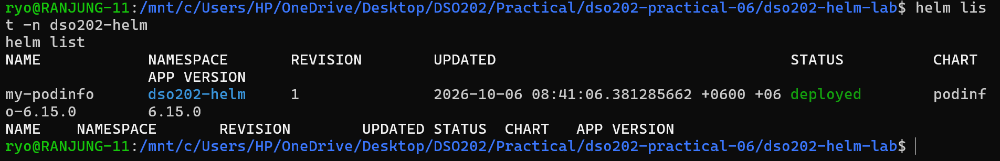

### Check objects and access the app

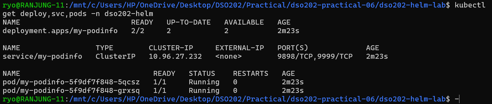

In one terminal, I have port-forwarded the pod to access the app.

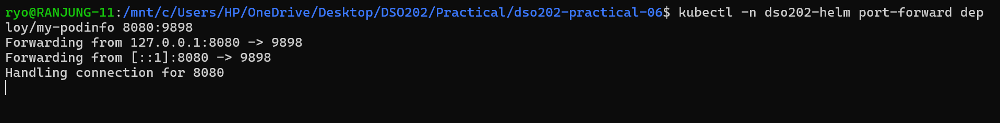

And in another terminal, I have accessed the app using curl.

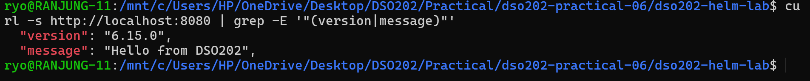

Then Inspected the release and checked the logs.

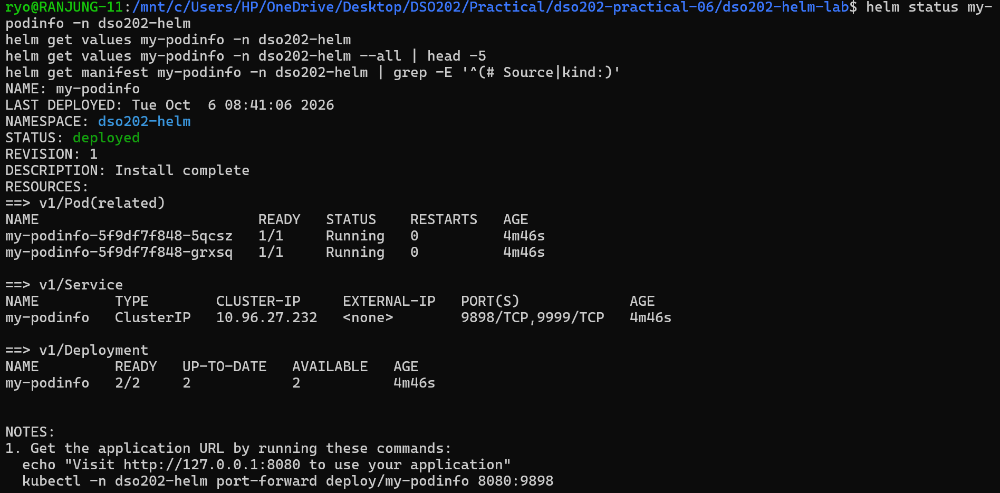

I have also checked the release records secrets.

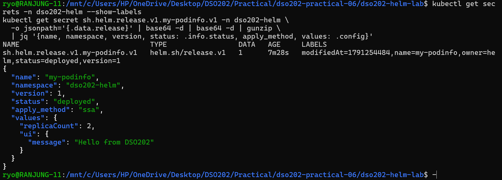

### Failure demo, the "lost values" upgrade:

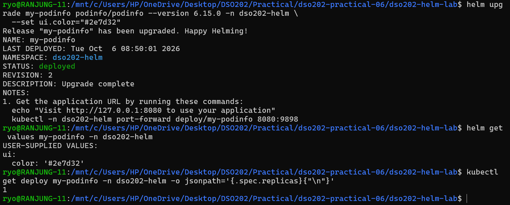

Fix it by using the `--reuse-values` flag.

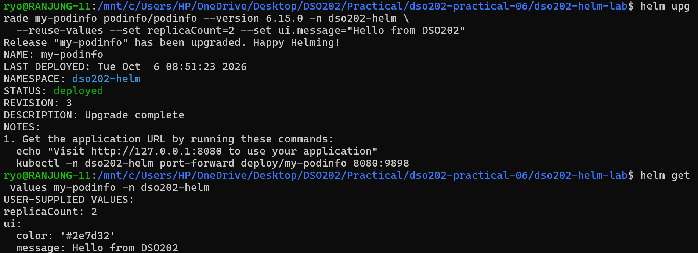

### Rollback and history

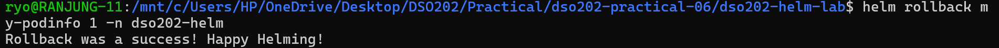

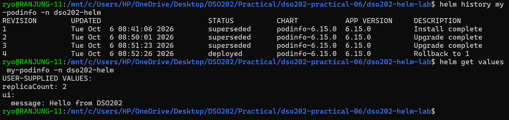

### Uninstall

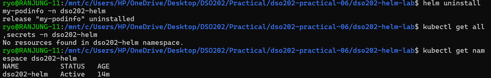

### Install from an OCI registry

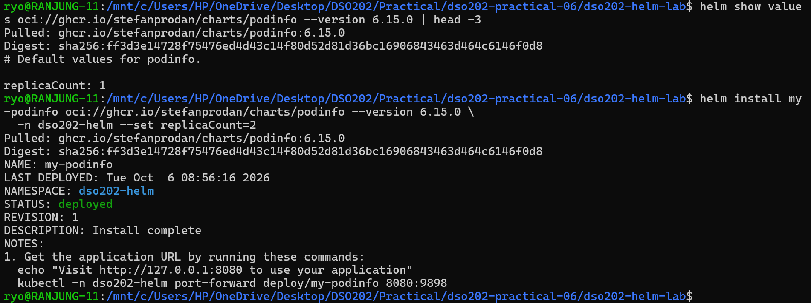

After that I have uninstalled the release.

## Stage 2: Build our own chart skeleton (webapp)

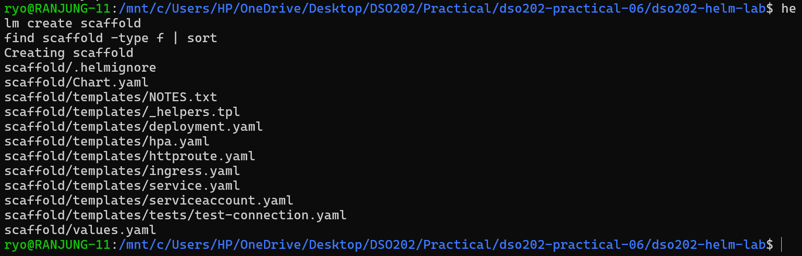

After that, I have created the chart and checked the files. Then I have deleted the default templates and created my own templates for the webapp.

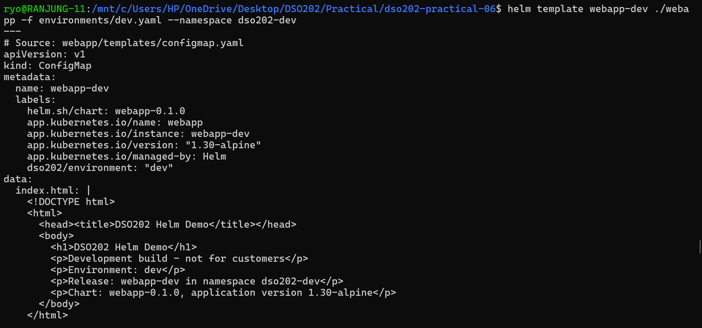

Render a single file.

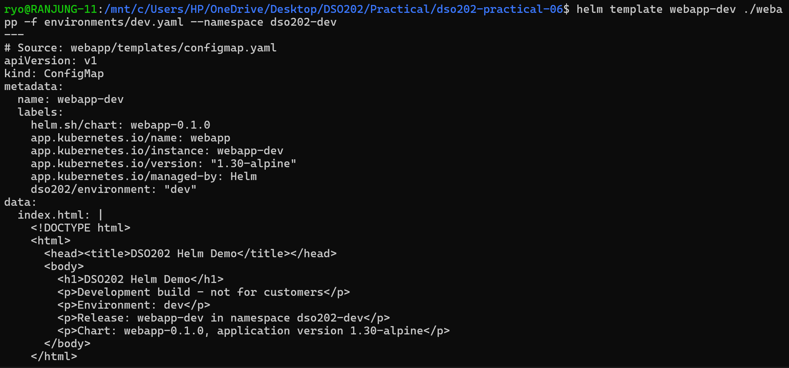

### Values precedence and merging

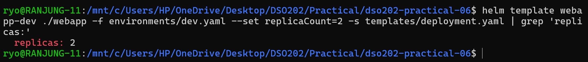

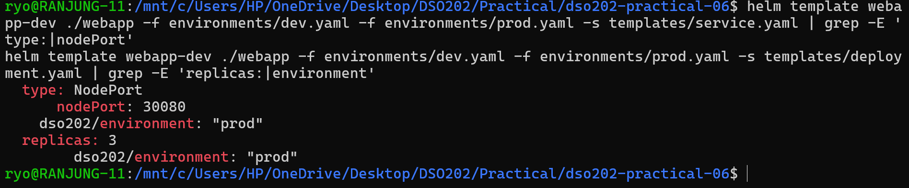

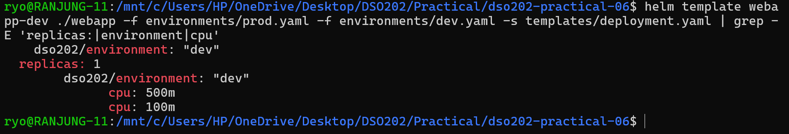

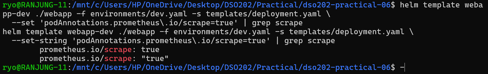

## Validation (four failures and fixes)

### Failure 1: missing required value

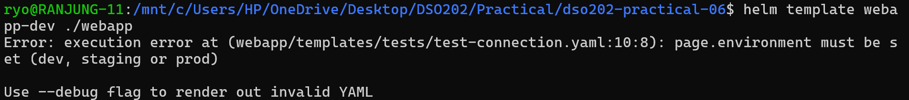

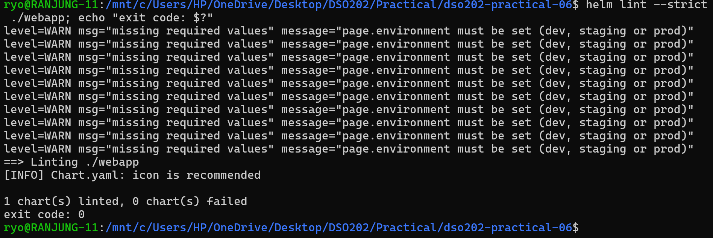

### Failure 2: indentation

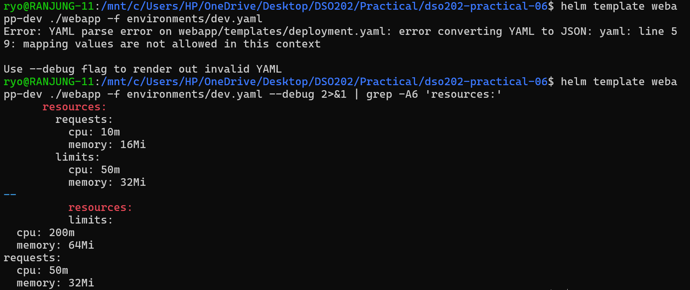

### Failure 3: number instead of string

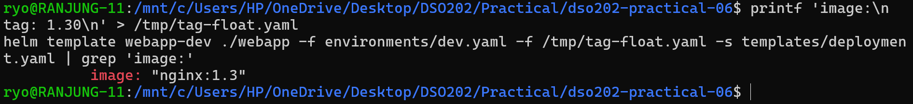

Here I have created a file called `values.schema.json`. Helm validates the merged values against it on every install, upgrade, lint and template, before any template is rendered.

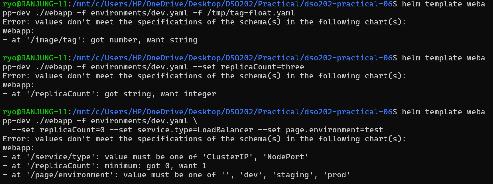

### Failure 4: misspelled Kubernetes field

Here in the deployment.yaml file, I have misspelled the `replicas` field as `replica`. This is a Kubernetes field and Helm does not validate it. So, I have to check the Kubernetes documentation to find the correct spelling.

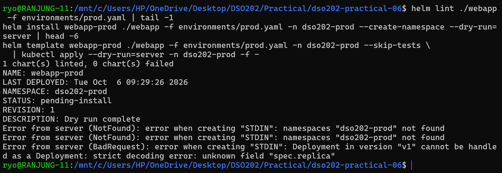

### Final check for both environments:

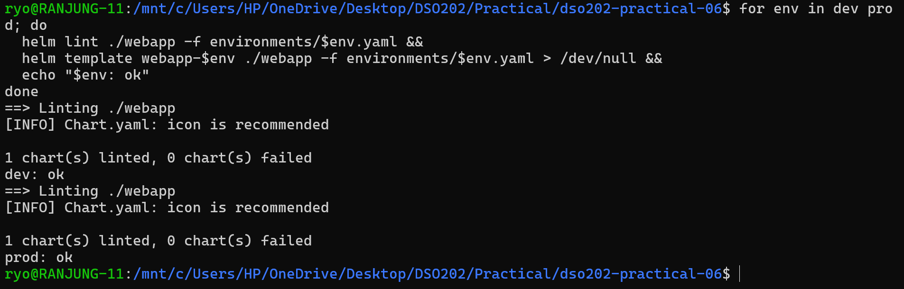

